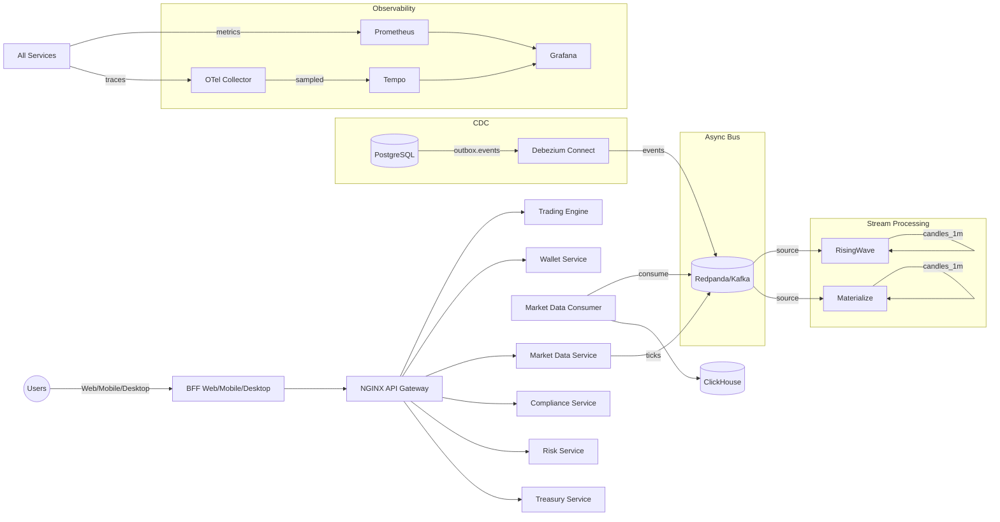

## exc — Exchange of Crypto

Nền tảng trao đổi tài sản số (crypto exchange) theo định hướng hiện đại, ưu tiên khả năng mở rộng, an toàn, và khả năng vận hành.

## 🏗️ Cấu trúc dự án hiện tại (Đã triển khai)

```text
.
├─ apps/                                  # Frontend Applications
│  ├─ bff-web/                           # Backend-for-Frontend (Next.js + OIDC PKCE)
│  │   ├─ src/
│  │   │   ├─ auth/                      # OIDC PKCE authentication
│  │   │   ├─ services/                  # Typed API clients
│  │   │   └─ contracts/                 # OpenAPI generated types
│  │   ├─ app/                           # Next.js App Router
│  │   │   ├─ api/                       # API routes (wallet, auth)
│  │   │   ├─ login/                     # OIDC login page
│  │   │   └─ dashboard/                 # Protected dashboard
│  │   ├─ tests/                         # Pact contract tests
│  │   └─ pacts/                         # Generated Pact contracts
│  ├─ admin/                             # Admin Panel (skeleton)
│  ├─ bff-desktop/                       # Desktop BFF (skeleton)
│  └─ bff-mobile/                        # Mobile BFF (skeleton)
│
├─ services/                             # Backend Microservices
│  ├─ trading-engine/                    # Core Trading Engine (Go)
│  │   ├─ cmd/main.go                    # Health, metrics, order book
│  │   ├─ Dockerfile
│  │   └─ go.mod
│  ├─ market-data/                       # Market Data Service (Node.js)
│  │   ├─ src/
│  │   │   ├─ connectors/                # Binance, Redpanda
│  │   │   └─ server.js                  # WebSocket + REST API
│  │   ├─ Dockerfile
│  │   └─ package.json
│  ├─ market-data-consumer/              # Kafka → ClickHouse (Node.js)
│  │   ├─ src/index.js                   # Consumer + Prometheus metrics
│  │   ├─ Dockerfile
│  │   └─ package.json
│  ├─ wallet/                            # Wallet Service (Go)
│  │   ├─ cmd/main.go                    # Deposit, withdraw, health
│  │   ├─ Dockerfile
│  │   └─ go.mod
│  ├─ compliance/                        # Compliance Service (Go)
│  │   ├─ cmd/main.go                    # Health, metrics, demo endpoint
│  │   ├─ Dockerfile
│  │   └─ go.mod
│  ├─ risk/                              # Risk Service (Go)
│  │   ├─ cmd/main.go                    # Health, metrics, demo endpoint
│  │   ├─ Dockerfile
│  │   └─ go.mod
│  ├─ treasury/                          # Treasury Service (Go)
│  │   ├─ cmd/main.go                    # Health, metrics, demo endpoint
│  │   ├─ Dockerfile
│  │   └─ go.mod
│  ├─ identity/                          # Identity Service (skeleton)
│  ├─ notification/                      # Notification Service (skeleton)
│  ├─ payment/                           # Payment Service (skeleton)
│  ├─ reporting/                         # Reporting Service (skeleton)
│  └─ api-gateway/                       # API Gateway (skeleton)
│
├─ infrastructure/                       # Infrastructure & DevOps
│  ├─ nginx/                             # NGINX API Gateway
│  │   └─ nginx.conf                     # Routing, rate limiting, WS upgrade
│  ├─ kubernetes/                        # Kubernetes Resources
│  │   ├─ helm/exc/                      # Helm Chart for all services
│  │   │   ├─ Chart.yaml
│  │   │   ├─ values.yaml                # Service configurations
│  │   │   └─ templates/                 # Deployment templates
│  │   ├─ gateway/                       # Gateway API
│  │   │   └─ http-gateway.yaml          # Gateway + HTTPRoute
│  │   ├─ ingress/                       # Ingress NGINX
│  │   │   └─ api-ingress.yaml           # API routing
│  │   ├─ argocd/                        # GitOps
│  │   │   └─ application-exc.yaml       # ArgoCD Application
│  │   ├─ policies/                      # OPA/Gatekeeper
│  │   │   └─ deny-unsigned-images.yaml  # Image signing policy
│  │   ├─ eso/                           # External Secrets Operator
│  │   │   └─ secretstore.yaml           # Vault integration
│  │   ├─ addons/                        # Infrastructure Components
│  │   │   ├─ mongodb.yaml               # MongoDB deployment
│  │   │   ├─ metrics-server.yaml        # Kubernetes metrics
│  │   │   ├─ valkey.yaml                # Redis-compatible cache
│  │   │   ├─ backup-mongodb.yaml        # Backup CronJob
│  │   │   ├─ restore-mongodb.yaml       # Restore Job template
│  │   │   ├─ finops-limitrange-quota.yaml # Resource limits
│  │   │   └─ priorityclasses.yaml       # Pod priorities
│  │   └─ chaos/                         # Chaos Engineering
│  │       └─ pod-delete-wallet.yaml     # Pod deletion chaos
│  ├─ docker/                            # Docker Configuration
│  │   └─ otel-collector-config.yml      # OpenTelemetry config
│  ├─ terraform/                         # Infrastructure as Code (skeleton)
│  ├─ ansible/                           # Configuration Management (skeleton)
│  └─ ci/                                # CI/CD Pipelines (skeleton)
│
├─ deployment/                           # Deployment & Monitoring
│  ├─ monitoring/                        # Observability Stack
│  │   ├─ prometheus/                    # Prometheus Configuration
│  │   │   └─ prometheus.yml             # Service discovery
│  │   ├─ grafana/                       # Grafana Dashboards
│  │   │   └─ dashboards/json/           # Dashboard JSON files
│  │   │       ├─ wallet-overview.json
│  │   │       ├─ compliance-overview.json
│  │   │       ├─ risk-overview.json
│  │   │       ├─ treasury-overview.json
│  │   │       └─ cluster-resources.json
│  │   └─ alertmanager/                  # Alerting (skeleton)
│  ├─ streaming/                         # Stream Processing
│  │   ├─ risingwave/                    # RisingWave SQL
│  │   │   └─ candles.sql                # 1-minute candles MV
│  │   └─ materialize/                   # Materialize SQL
│  │       └─ candles.sql                # 1-minute candles MV
│  ├─ connect/                           # Debezium CDC
│  │   └─ connectors/                    # Connector Configurations
│  │       └─ postgres-outbox.config.json # PostgreSQL outbox
│  └─ asyncapi/                          # AsyncAPI Specifications
│      └─ market-data.yml                # Market data events
│
├─ database/                             # Database & Migrations
│  ├─ migrations/                        # Database Migrations
│  │   ├─ 20250811130000_add_outbox.sql  # Transactional outbox
│  │   ├─ 20250811130500_wallet_ledger.sql # Double-entry ledger
│  │   └─ 20250811131000_indexes_partitioning.sql # Performance indexes
│  └─ schemas/                           # Database Schemas (skeleton)
│
├─ shared/                               # Shared Libraries (skeleton)
├─ packages/                             # Monorepo Packages (skeleton)
├─ tests/                                # Testing Framework
│  ├─ contract/                          # Contract Testing (skeleton)
│  ├─ e2e/                               # End-to-End Tests (skeleton)
│  └─ integration/                       # Integration Tests (skeleton)
│
├─ docs/                                 # Documentation
│  └─ adr/                               # Architecture Decision Records (skeleton)
├─ security/                             # Security Policies (skeleton)
├─ ops/                                  # Operations (skeleton)
├─ tools/                                # Development Tools
│  └─ ai-agents/                         # AI Agents (skeleton)
├─ thirdparty/                           # Third-party Integrations
│  ├─ exchanges/                         # Exchange APIs (skeleton)
│  └─ gitLibrary/                        # Git Libraries (skeleton)
│
├─ plan/                                 # Project Planning
│  ├─ crypto_exchanges_components.md     # System Components Overview
│  └─ crypto_exchange_components.md      # Detailed Architecture Plan
│
├─ web/                                  # Web Applications (skeleton)
│  ├─ trading-app/                       # React Trading Interface
│  ├─ admin-panel/                       # React Admin Dashboard
│  ├─ landing-page/                      # React Marketing Site
│  └─ flutter/                           # Flutter Web Apps
├─ mobile/                               # Mobile Applications (skeleton)
│  ├─ trading-app/                       # React Native Trading App
│  ├─ admin-mobile/                      # React Native Admin App
│  └─ flutter/                           # Flutter Mobile Apps
├─ desktop/                              # Desktop Applications (skeleton)
│  ├─ trading-app/                       # Electron Trading App
│  ├─ admin-panel/                       # Electron Admin Panel
│  ├─ flutter/                           # Flutter Desktop Apps
│  └─ installer/                         # Cross-platform Installers
│
├─ docker-compose.yml                    # Core Services (Postgres, Redis, Kafka, etc.)
├─ docker-compose.override.yml           # Development Services (Redpanda, ClickHouse, etc.)
├─ Makefile                              # Build & Deployment Automation
└─ README.md                             # This file
```

## 🚀 Kiến trúc hiện đại đã triển khai

### 1) Mô hình tổng thể
- **Domain-Driven Design (DDD)**: Phân chia theo miền nghiệp vụ (Trading, Wallet, Market Data, Compliance, Risk, Treasury)
- **Event-Driven Architecture**: Redpanda/Kafka cho events, Debezium CDC cho reliable event publishing
- **Stream Processing**: RisingWave và Materialize cho real-time analytics (candles, VWAP)
- **API Gateway + BFF**: NGINX Gateway + Next.js BFF với OIDC PKCE authentication
- **Observability by default**: OpenTelemetry, Prometheus, Grafana, Tempo với tail-based sampling

### 1.1) Tính nhất quán dữ liệu
- **Transactional Outbox + CDC (Debezium)**: Đã triển khai `outbox.events` table và Debezium connector
- **Idempotency**: Đã implement trong BFF wallet endpoints
- **Event Sourcing**: Sẵn sàng cho audit và replay



### 2) Lựa chọn kiến trúc triển khai
- **Giai đoạn hiện tại: Microservices** với các service độc lập
- **Giao tiếp**: REST APIs qua NGINX Gateway, events qua Redpanda
- **Database per Service**: PostgreSQL cho business data, ClickHouse cho market data
- **Caching**: Valkey (Redis-compatible) cho cache và rate limiting

## 🛠️ Công nghệ đã triển khai

### Backend Services
- **Go 1.22+**: `trading-engine`, `wallet`, `compliance`, `risk`, `treasury` services
- **Node.js 20+**: `market-data`, `market-data-consumer` services
- **Gin Framework**: REST APIs với health checks và Prometheus metrics
- **WebSocket**: Real-time market data streaming

### Frontend & BFF
- **Next.js 14+**: BFF với App Router, OIDC PKCE authentication
- **TypeScript**: Type-safe development với OpenAPI codegen
- **Tailwind CSS**: Modern UI styling
- **Pact**: Contract testing giữa BFF và backend services

### Infrastructure & DevOps
- **Docker Compose**: Local development environment
- **Kubernetes**: Helm charts, Gateway API, Ingress NGINX
- **ArgoCD**: GitOps deployment
- **Prometheus + Grafana**: Monitoring và alerting
- **OpenTelemetry**: Distributed tracing với sampling
- **Redpanda**: Event streaming platform
- **ClickHouse**: Time-series database cho market data
- **PostgreSQL**: ACID transactional database
- **Valkey**: Redis-compatible cache

### Security & Compliance
- **Keycloak**: OIDC/OAuth2 identity provider
- **Vault**: Secrets management
- **OPA/Gatekeeper**: Policy enforcement (skeleton)
- **External Secrets Operator**: Kubernetes secrets integration

### Stream Processing
- **RisingWave**: Real-time stream processing
- **Materialize**: Materialized views
- **Debezium**: Change Data Capture từ PostgreSQL

## 📊 Tiến độ triển khai (Checklist)

### ✅ Đã hoàn thành (1-12)
- [x] **1**: Khởi tạo monorepo, scaffold API Gateway, BFF và core services
- [x] **2**: CI/CD cơ bản, lint/format, logging/tracing
- [x] **3**: Postgres/Redis + migrations, auth cơ bản (Keycloak)
- [x] **4**: Trading engine tối giản + endpoints/metrics
- [x] **5**: Market data (WebSocket + Prometheus), seed Redpanda
- [x] **6**: Observability (Prometheus/Grafana/Tempo/OTel) + dashboards
- [x] **7**: Transactional Outbox + Debezium CDC (topic outbox.events)
- [x] **8**: Stream processing (RisingWave/Materialize) + MV candles
- [x] **9**: Wallet/Treasury services + endpoints demo, sổ cái kép
- [x] **10**: Keycloak (OIDC), Vault; nền tảng policy/chain supply
- [x] **11**: Tail-based sampling; SLO/Dashboards khởi tạo
- [x] **12**: Tối ưu partitioning/backpressure (BRIN indexes, rate limits, HPA)

### 🔄 Đang triển khai (13-20)
- [x] **13**: BFF Web hoàn thiện + OIDC PKCE end-to-end ✅
  - ✅ Next.js BFF với OIDC PKCE authentication
  - ✅ Typed API clients (OpenAPI codegen)
  - ✅ Pact contract tests
  - ✅ Session management với JWT
- [ ] **14**: Contracts & codegen hoàn thiện
  - ✅ OpenAPI codegen cho Wallet API
  - ✅ Pact consumer tests
  - [ ] Provider verification automation
  - [ ] gRPC/AsyncAPI codegen
- [ ] **15**: Dữ liệu & migrations hoàn thiện
  - ✅ Basic migrations (outbox, ledger)
  - [ ] Atlas pipeline (CI lint/diff/apply)
  - [ ] Detailed double-entry ledger schema
  - [ ] Temporal reconciliation jobs
- [ ] **16**: CI/CD & security supply chain
  - ✅ SBOM generation (Syft)
  - ✅ Image signing (Cosign)
  - ✅ OPA/Gatekeeper policies (skeleton)
  - ✅ ESO + Vault integration (skeleton)
  - [ ] SLSA compliance
  - [ ] Image scanning automation
- [ ] **17**: Hiệu năng & reliability
  - ✅ Basic HPA autoscaling
  - [ ] k6 load testing
  - [ ] Canary/blue-green deployments
  - [ ] KEDA autoscaling for consumers
  - [ ] Complete SLO/error budget
  - [ ] Full alerts/runbooks
- [ ] **18**: K8s hoá hoàn thiện
  - ✅ Helm charts cho core services
  - ✅ Gateway API + Ingress NGINX
  - ✅ ArgoCD GitOps
  - [ ] Service mesh (Istio/Linkerd)
  - [ ] Progressive delivery
- [ ] **19**: Multi-tenant/region
  - ✅ Basic DR/backup (MongoDB)
  - ✅ Chaos testing (pod deletion)
  - [ ] Partitioning strategy
  - [ ] Data residency
  - [ ] Advanced chaos suite
- [ ] **20**: FinOps & quan sát chi phí
  - ✅ Basic resource limits/quotas
  - ✅ Cluster resource dashboard
  - [ ] Cloud cost dashboards
  - [ ] Budget alerts
  - [ ] Resource optimization

### 🚀 Lộ trình phát triển giai đoạn tiếp (21-30)

#### **21. Exchange Integration & Market Data Aggregation**
- [ ] **Binance Integration**: Real-time market data, order book, trading APIs
  - [ ] WebSocket streams (ticker, depth, trades)
  - [ ] REST API integration (order placement, account info)
  - [ ] Rate limiting và error handling
- [ ] **Coinbase Integration**: Additional liquidity source
  - [ ] Market data feeds
  - [ ] Trading API integration
- [ ] **Kraken Integration**: European market access
  - [ ] Real-time data streaming
  - [ ] Order management
- [ ] **Market Data Aggregator**: Unified data feed
  - [ ] Price normalization và validation
  - [ ] Cross-exchange arbitrage detection
  - [ ] Market depth consolidation

#### **22. Advanced Trading Engine & Order Matching**
- [ ] **Order Book Implementation**: Based on opencx patterns
  - [ ] Price-time priority matching
  - [ ] Market/limit order types
  - [ ] Stop-loss và take-profit orders
- [ ] **Matching Engine**: High-performance order matching
  - [ ] FIFO matching algorithm
  - [ ] Partial fills handling
  - [ ] Order cancellation và modification
- [ ] **Risk Management**: Real-time position monitoring
  - [ ] Position limits enforcement
  - [ ] Margin requirement checks
  - [ ] Circuit breakers

#### **23. Banking & Payment Integration**
- [ ] **Bank Integration**: Based on Bank-Go patterns
  - [ ] SWIFT/SEPA payment processing
  - [ ] Bank account verification
  - [ ] Transaction reconciliation
- [ ] **Payment Gateway**: Multi-provider support
  - [ ] Stripe integration
  - [ ] PayPal integration
  - [ ] Crypto payment processing
- [ ] **Settlement Engine**: Automated settlement
  - [ ] T+0/T+1 settlement cycles
  - [ ] Multi-currency support
  - [ ] Settlement risk management

#### **24. Compliance & Regulatory Framework**
- [ ] **KYC/KYB System**: Customer onboarding
  - [ ] Document verification (ID, proof of address)
  - [ ] Face recognition integration
  - [ ] Risk scoring algorithms
- [ ] **AML Screening**: Transaction monitoring
  - [ ] Sanctions list checking
  - [ ] Suspicious activity detection
  - [ ] Regulatory reporting
- [ ] **Audit Trail**: Complete transaction history
  - [ ] Immutable audit logs
  - [ ] Regulatory compliance reports
  - [ ] Data retention policies

#### **25. Advanced Analytics & Reporting**
- [ ] **Trading Analytics**: Performance metrics
  - [ ] P&L tracking per user/strategy
  - [ ] Risk-adjusted returns
  - [ ] Portfolio analytics
- [ ] **Market Analytics**: Market intelligence
  - [ ] Volume analysis
  - [ ] Price correlation studies
  - [ ] Market microstructure analysis
- [ ] **Regulatory Reporting**: Automated compliance
  - [ ] MiFID II reporting
  - [ ] FATCA/CRS reporting
  - [ ] Local regulatory requirements

#### **26. Mobile & Desktop Applications**
- [ ] **Mobile BFF**: React Native implementation
  - [ ] Cross-platform trading app
  - [ ] Push notifications
  - [ ] Offline capability
- [ ] **Desktop Application**: Electron-based
  - [ ] Advanced trading interface
  - [ ] Charting tools integration
  - [ ] Multi-window support
- [ ] **Admin Panel**: Management interface
  - [ ] User management
  - [ ] System monitoring
  - [ ] Configuration management

#### **27. Advanced Security & Identity Management**
- [ ] **Multi-Factor Authentication**: Enhanced security
  - [ ] TOTP/HOTP support
  - [ ] Hardware security keys
  - [ ] Biometric authentication
- [ ] **Identity Federation**: SSO integration
  - [ ] SAML/OIDC providers
  - [ ] Enterprise SSO
  - [ ] Social login integration
- [ ] **Advanced Authorization**: Fine-grained access control
  - [ ] Role-based access control (RBAC)
  - [ ] Attribute-based access control (ABAC)
  - [ ] Dynamic permission evaluation

#### **28. High Availability & Disaster Recovery**
- [ ] **Multi-Region Deployment**: Geographic distribution
  - [ ] Active-active configuration
  - [ ] Data replication strategies
  - [ ] Cross-region failover
- [ ] **Backup & Recovery**: Comprehensive DR
  - [ ] Automated backup scheduling
  - [ ] Point-in-time recovery
  - [ ] Disaster recovery testing
- [ ] **Business Continuity**: Operational resilience
  - [ ] RTO/RPO objectives
  - [ ] Incident response procedures
  - [ ] Communication protocols

#### **29. Performance Optimization & Scalability**
- [ ] **Database Optimization**: Advanced partitioning
  - [ ] Time-series partitioning
  - [ ] Sharding strategies
  - [ ] Read replicas
- [ ] **Caching Strategy**: Multi-layer caching
  - [ ] Application-level caching
  - [ ] Database query caching
  - [ ] CDN integration
- [ ] **Load Balancing**: Advanced traffic management
  - [ ] Global load balancing
  - [ ] Health-based routing
  - [ ] Circuit breaker patterns

#### **30. AI/ML Integration & Automation**
- [ ] **Trading Bots**: Automated trading strategies
  - [ ] Market making bots
  - [ ] Arbitrage bots
  - [ ] Portfolio rebalancing
- [ ] **Risk Prediction**: ML-based risk assessment
  - [ ] Fraud detection models
  - [ ] Market risk prediction
  - [ ] Credit risk scoring
- [ ] **Customer Intelligence**: Personalized services
  - [ ] Recommendation engines
  - [ ] Customer segmentation
  - [ ] Churn prediction

### 📋 Third-party Integration Roadmap

#### **Exchange APIs** (Tham khảo `thirdparty/exchanges/`)
- [ ] **Binance**: Complete API integration
- [ ] **Coinbase**: Pro API integration  
- [ ] **Kraken**: Trading API integration
- [ ] **FTX**: Futures trading (if available)
- [ ] **Bybit**: Derivatives trading

#### **Banking & Payment** (Tham khảo `thirdparty/gitLibrary/Bank-Go/`)
- [ ] **SWIFT Integration**: International payments
- [ ] **SEPA Integration**: European payments
- [ ] **ACH Integration**: US payments
- [ ] **Crypto Payment**: Bitcoin/Ethereum processing

#### **Trading Engine** (Tham khảo `thirdparty/gitLibrary/opencx/`)
- [ ] **Order Book**: High-performance implementation
- [ ] **Matching Engine**: FIFO/Pro-rata algorithms
- [ ] **Risk Engine**: Real-time position monitoring
- [ ] **Settlement Engine**: Automated clearing

#### **Compliance & Security** (Tham khảo `thirdparty/gitLibrary/peatio/`)
- [ ] **KYC/AML**: Customer verification
- [ ] **Audit Trail**: Complete transaction history
- [ ] **Regulatory Reporting**: Automated compliance
- [ ] **Security Monitoring**: Threat detection

## 🚀 Bắt đầu (Development)

### Yêu cầu hệ thống
- **Node.js 20/22 LTS**
- **Go 1.22+**
- **Docker & Docker Compose**
- **Kubernetes** (minikube/kind/k3s)
- **kubectl**

### Khởi động môi trường development

```bash
# 1. Clone repository
git clone <repository-url>
cd exc

# 2. Khởi động infrastructure
docker compose up -d

# 3. Build và chạy services
make build
make dev

# 4. Deploy to Kubernetes (optional)
make k8s-deploy
```

### Quick checks (Services đang chạy)

#### Core Services
- **Trading Engine**: http://localhost:8080/health
- **Market Data**: http://localhost:8083/health
- **Wallet**: http://localhost:8081/health
- **Compliance**: http://localhost:8087/health
- **Risk**: http://localhost:8085/health
- **Treasury**: http://localhost:8086/health

#### API Gateway (NGINX)
- **Health**: http://localhost:8088/health
- **Trading API**: http://localhost:8088/api/trading/health
- **Wallet API**: http://localhost:8088/api/wallet/health
- **Market Data WS**: ws://localhost:8088/api/market-data/ws

#### BFF Web Application
- **Login**: http://localhost:3000/login
- **Dashboard**: http://localhost:3000/dashboard (requires auth)

#### Observability
- **Grafana**: http://localhost:43000
  - Dashboards: Market Data, Trading Engine, Wallet, Compliance, Risk, Treasury
- **Prometheus**: http://localhost:9090
- **Tempo**: http://localhost:3200

#### Infrastructure
- **Keycloak**: http://localhost:18084 (admin/admin)
- **Vault**: http://localhost:18200
- **Redpanda Console**: http://localhost:8081
- **ClickHouse**: http://localhost:8123

### Development Commands

```bash
# Build all services
make build

# Run development environment
make dev

# Run tests
make test

# Generate OpenAPI types
cd apps/bff-web && npm run gen:openapi

# Run Pact tests
cd apps/bff-web && npm run test

# Deploy to Kubernetes
make k8s-deploy

# Generate SBOM
make sbom

# Sign images
make cosign-sign
```

## 📚 Tài liệu liên quan

### Architecture & Design
- [plan/crypto_exchange_components.md](plan/crypto_exchange_components.md) - Chi tiết kiến trúc hệ thống
- [plan/crypto_exchanges_components.md](plan/crypto_exchanges_components.md) - Tổng quan các thành phần

### Service Documentation
- [services/README.md](services/README.md) - Backend services
- [apps/bff-web/README.md](apps/bff-web/README.md) - BFF Web application
- [infrastructure/README.md](infrastructure/README.md) - Infrastructure setup

### Deployment & Operations
- [deployment/README.md](deployment/README.md) - Deployment guides
- [database/README_database.md](database/README_database.md) - Database management
- [security/README.md](security/README.md) - Security policies

## 🤝 Đóng góp

Xem [CONTRIBUTING.md](CONTRIBUTING.md) để biết hướng dẫn đóng góp.

## 📄 License

Xem [LICENSE](LICENSE) để biết thông tin về license.

---

**🎉 Crypto Exchange Platform đã sẵn sàng cho development và testing!**

Hệ thống hiện tại đã triển khai đầy đủ các thành phần cốt lõi:
- ✅ Microservices architecture với 7 core services
- ✅ Event-driven architecture với Redpanda/Kafka
- ✅ Stream processing với RisingWave/Materialize
- ✅ Observability stack hoàn chỉnh
- ✅ Security với OIDC PKCE authentication
- ✅ Kubernetes deployment với GitOps
- ✅ Contract testing với Pact
- ✅ BFF pattern cho frontend integration
