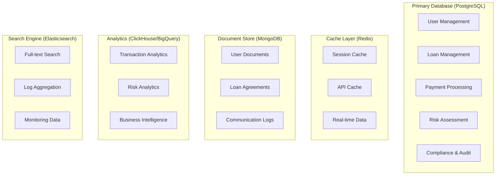

# 🗄️ CẤU TRÚC DATABASE CHO HỆ THỐNG P2P LENDING

## 📋 TỔNG QUAN

Dựa trên phân tích từ các tài liệu về hệ thống P2P Lending tại Việt Nam, tài liệu này mô tả cấu trúc database toàn diện cho nền tảng cho vay ngang hàng, bao gồm tất cả các thành phần cần thiết từ quản lý người dùng, khoản vay, thanh toán, đến báo cáo và tuân thủ pháp lý.

---

## 🏗️ KIẾN TRÚC DATABASE TỔNG THỂ

### **Database Architecture Overview**



---

## 👥 1. USER MANAGEMENT DATABASE

### **1.1 Users Table**
```sql
CREATE TABLE users (
    id UUID PRIMARY KEY DEFAULT gen_random_uuid(),
    email VARCHAR(255) UNIQUE NOT NULL,
    phone VARCHAR(20) UNIQUE NOT NULL,
    password_hash VARCHAR(255) NOT NULL,
    first_name VARCHAR(100) NOT NULL,
    last_name VARCHAR(100) NOT NULL,
    date_of_birth DATE,
    gender VARCHAR(10),
    national_id VARCHAR(20) UNIQUE,
    address TEXT,
    city VARCHAR(100),
    province VARCHAR(100),
    postal_code VARCHAR(20),
    country VARCHAR(100) DEFAULT 'Vietnam',
    user_type VARCHAR(20) NOT NULL CHECK (user_type IN ('borrower', 'lender', 'admin', 'staff')),
    status VARCHAR(20) DEFAULT 'pending' CHECK (status IN ('pending', 'active', 'suspended', 'blocked')),
    kyc_status VARCHAR(20) DEFAULT 'pending' CHECK (kyc_status IN ('pending', 'verified', 'rejected', 'expired')),
    kyc_verified_at TIMESTAMP,
    last_login_at TIMESTAMP,
    created_at TIMESTAMP DEFAULT CURRENT_TIMESTAMP,
    updated_at TIMESTAMP DEFAULT CURRENT_TIMESTAMP,
    deleted_at TIMESTAMP
);

-- Indexes
CREATE INDEX idx_users_email ON users(email);
CREATE INDEX idx_users_phone ON users(phone);
CREATE INDEX idx_users_national_id ON users(national_id);
CREATE INDEX idx_users_user_type ON users(user_type);
CREATE INDEX idx_users_status ON users(status);
CREATE INDEX idx_users_kyc_status ON users(kyc_status);
```

### **1.2 User Profiles Table**
```sql
CREATE TABLE user_profiles (
    id UUID PRIMARY KEY DEFAULT gen_random_uuid(),
    user_id UUID NOT NULL REFERENCES users(id) ON DELETE CASCADE,
    profile_type VARCHAR(20) NOT NULL CHECK (profile_type IN ('individual', 'business')),
    
    -- Individual Profile
    occupation VARCHAR(100),
    employer_name VARCHAR(200),
    monthly_income DECIMAL(15,2),
    employment_status VARCHAR(50),
    education_level VARCHAR(50),
    
    -- Business Profile
    business_name VARCHAR(200),
    business_type VARCHAR(100),
    business_registration_number VARCHAR(50),
    business_address TEXT,
    business_phone VARCHAR(20),
    annual_revenue DECIMAL(15,2),
    number_of_employees INTEGER,
    business_established_date DATE,
    
    -- Investment Profile (for lenders)
    investment_experience VARCHAR(50),
    risk_tolerance VARCHAR(20),
    preferred_loan_types TEXT[],
    maximum_investment_amount DECIMAL(15,2),
    
    created_at TIMESTAMP DEFAULT CURRENT_TIMESTAMP,
    updated_at TIMESTAMP DEFAULT CURRENT_TIMESTAMP
);
```

### **1.3 User Documents Table**
```sql
CREATE TABLE user_documents (
    id UUID PRIMARY KEY DEFAULT gen_random_uuid(),
    user_id UUID NOT NULL REFERENCES users(id) ON DELETE CASCADE,
    document_type VARCHAR(50) NOT NULL,
    document_name VARCHAR(200) NOT NULL,
    file_path VARCHAR(500) NOT NULL,
    file_size BIGINT,
    mime_type VARCHAR(100),
    verification_status VARCHAR(20) DEFAULT 'pending' CHECK (verification_status IN ('pending', 'verified', 'rejected')),
    verified_by UUID REFERENCES users(id),
    verified_at TIMESTAMP,
    rejection_reason TEXT,
    created_at TIMESTAMP DEFAULT CURRENT_TIMESTAMP,
    updated_at TIMESTAMP DEFAULT CURRENT_TIMESTAMP
);

-- Indexes
CREATE INDEX idx_user_documents_user_id ON user_documents(user_id);
CREATE INDEX idx_user_documents_type ON user_documents(document_type);
CREATE INDEX idx_user_documents_status ON user_documents(verification_status);
```

### **1.4 User Bank Accounts Table**
```sql
CREATE TABLE user_bank_accounts (
    id UUID PRIMARY KEY DEFAULT gen_random_uuid(),
    user_id UUID NOT NULL REFERENCES users(id) ON DELETE CASCADE,
    bank_name VARCHAR(100) NOT NULL,
    bank_code VARCHAR(20),
    account_number VARCHAR(50) NOT NULL,
    account_holder_name VARCHAR(200) NOT NULL,
    account_type VARCHAR(20) DEFAULT 'savings' CHECK (account_type IN ('savings', 'checking', 'business')),
    is_primary BOOLEAN DEFAULT FALSE,
    is_verified BOOLEAN DEFAULT FALSE,
    verified_at TIMESTAMP,
    created_at TIMESTAMP DEFAULT CURRENT_TIMESTAMP,
    updated_at TIMESTAMP DEFAULT CURRENT_TIMESTAMP
);

-- Indexes
CREATE INDEX idx_user_bank_accounts_user_id ON user_bank_accounts(user_id);
CREATE INDEX idx_user_bank_accounts_primary ON user_bank_accounts(user_id, is_primary) WHERE is_primary = TRUE;
```

---

## 💰 2. LOAN MANAGEMENT DATABASE

### **2.1 Loan Products Table**
```sql
CREATE TABLE loan_products (
    id UUID PRIMARY KEY DEFAULT gen_random_uuid(),
    product_name VARCHAR(200) NOT NULL,
    product_code VARCHAR(50) UNIQUE NOT NULL,
    product_type VARCHAR(50) NOT NULL CHECK (product_type IN ('personal', 'business', 'secured', 'unsecured')),
    description TEXT,
    
    -- Loan Terms
    min_amount DECIMAL(15,2) NOT NULL,
    max_amount DECIMAL(15,2) NOT NULL,
    min_term_months INTEGER NOT NULL,
    max_term_months INTEGER NOT NULL,
    
    -- Interest Rates
    base_interest_rate DECIMAL(5,4) NOT NULL, -- Annual rate
    min_interest_rate DECIMAL(5,4),
    max_interest_rate DECIMAL(5,4),
    
    -- Fees
    origination_fee_rate DECIMAL(5,4) DEFAULT 0,
    late_fee_rate DECIMAL(5,4) DEFAULT 0,
    prepayment_fee_rate DECIMAL(5,4) DEFAULT 0,
    
    -- Requirements
    min_credit_score INTEGER,
    required_documents TEXT[],
    eligibility_criteria JSONB,
    
    -- Status
    is_active BOOLEAN DEFAULT TRUE,
    created_by UUID REFERENCES users(id),
    created_at TIMESTAMP DEFAULT CURRENT_TIMESTAMP,
    updated_at TIMESTAMP DEFAULT CURRENT_TIMESTAMP
);
```

### **2.2 Loan Applications Table**
```sql
CREATE TABLE loan_applications (
    id UUID PRIMARY KEY DEFAULT gen_random_uuid(),
    application_number VARCHAR(50) UNIQUE NOT NULL,
    borrower_id UUID NOT NULL REFERENCES users(id),
    loan_product_id UUID NOT NULL REFERENCES loan_products(id),
    
    -- Loan Details
    requested_amount DECIMAL(15,2) NOT NULL,
    requested_term_months INTEGER NOT NULL,
    loan_purpose VARCHAR(200),
    loan_purpose_description TEXT,
    
    -- Application Status
    status VARCHAR(30) DEFAULT 'submitted' CHECK (status IN (
        'submitted', 'under_review', 'approved', 'rejected', 
        'funded', 'active', 'completed', 'defaulted', 'cancelled'
    )),
    
    -- Processing
    submitted_at TIMESTAMP DEFAULT CURRENT_TIMESTAMP,
    reviewed_at TIMESTAMP,
    reviewed_by UUID REFERENCES users(id),
    approved_at TIMESTAMP,
    approved_by UUID REFERENCES users(id),
    rejected_at TIMESTAMP,
    rejection_reason TEXT,
    
    -- Final Terms
    approved_amount DECIMAL(15,2),
    approved_term_months INTEGER,
    approved_interest_rate DECIMAL(5,4),
    approved_origination_fee DECIMAL(15,2),
    
    -- Risk Assessment
    credit_score INTEGER,
    risk_rating VARCHAR(10),
    risk_factors JSONB,
    
    created_at TIMESTAMP DEFAULT CURRENT_TIMESTAMP,
    updated_at TIMESTAMP DEFAULT CURRENT_TIMESTAMP
);

-- Indexes
CREATE INDEX idx_loan_applications_borrower_id ON loan_applications(borrower_id);
CREATE INDEX idx_loan_applications_status ON loan_applications(status);
CREATE INDEX idx_loan_applications_submitted_at ON loan_applications(submitted_at);
CREATE INDEX idx_loan_applications_application_number ON loan_applications(application_number);
```

### **2.3 Loans Table**
```sql
CREATE TABLE loans (
    id UUID PRIMARY KEY DEFAULT gen_random_uuid(),
    loan_number VARCHAR(50) UNIQUE NOT NULL,
    application_id UUID NOT NULL REFERENCES loan_applications(id),
    borrower_id UUID NOT NULL REFERENCES users(id),
    loan_product_id UUID NOT NULL REFERENCES loan_products(id),
    
    -- Loan Terms
    principal_amount DECIMAL(15,2) NOT NULL,
    term_months INTEGER NOT NULL,
    interest_rate DECIMAL(5,4) NOT NULL,
    origination_fee DECIMAL(15,2) DEFAULT 0,
    
    -- Dates
    disbursement_date DATE,
    first_payment_date DATE,
    maturity_date DATE,
    
    -- Payment Schedule
    payment_frequency VARCHAR(20) DEFAULT 'monthly' CHECK (payment_frequency IN ('weekly', 'biweekly', 'monthly', 'quarterly')),
    payment_amount DECIMAL(15,2),
    
    -- Status
    status VARCHAR(30) DEFAULT 'pending_disbursement' CHECK (status IN (
        'pending_disbursement', 'active', 'completed', 'defaulted', 
        'charged_off', 'cancelled', 'refinanced'
    )),
    
    -- Financial Tracking
    principal_balance DECIMAL(15,2) NOT NULL,
    interest_balance DECIMAL(15,2) DEFAULT 0,
    late_fees_balance DECIMAL(15,2) DEFAULT 0,
    total_balance DECIMAL(15,2) NOT NULL,
    
    -- Performance
    days_past_due INTEGER DEFAULT 0,
    last_payment_date DATE,
    next_payment_date DATE,
    
    created_at TIMESTAMP DEFAULT CURRENT_TIMESTAMP,
    updated_at TIMESTAMP DEFAULT CURRENT_TIMESTAMP
);

-- Indexes
CREATE INDEX idx_loans_borrower_id ON loans(borrower_id);
CREATE INDEX idx_loans_status ON loans(status);
CREATE INDEX idx_loans_loan_number ON loans(loan_number);
CREATE INDEX idx_loans_next_payment_date ON loans(next_payment_date);
CREATE INDEX idx_loans_days_past_due ON loans(days_past_due);
```

### **2.4 Loan Investments Table**
```sql
CREATE TABLE loan_investments (
    id UUID PRIMARY KEY DEFAULT gen_random_uuid(),
    loan_id UUID NOT NULL REFERENCES loans(id),
    lender_id UUID NOT NULL REFERENCES users(id),
    investment_amount DECIMAL(15,2) NOT NULL,
    investment_date TIMESTAMP DEFAULT CURRENT_TIMESTAMP,
    expected_return_rate DECIMAL(5,4) NOT NULL,
    status VARCHAR(20) DEFAULT 'active' CHECK (status IN ('active', 'completed', 'defaulted', 'cancelled')),
    
    -- Returns
    total_principal_received DECIMAL(15,2) DEFAULT 0,
    total_interest_received DECIMAL(15,2) DEFAULT 0,
    total_fees_received DECIMAL(15,2) DEFAULT 0,
    
    created_at TIMESTAMP DEFAULT CURRENT_TIMESTAMP,
    updated_at TIMESTAMP DEFAULT CURRENT_TIMESTAMP,
    
    UNIQUE(loan_id, lender_id)
);

-- Indexes
CREATE INDEX idx_loan_investments_loan_id ON loan_investments(loan_id);
CREATE INDEX idx_loan_investments_lender_id ON loan_investments(lender_id);
CREATE INDEX idx_loan_investments_status ON loan_investments(status);
```

---

## 💳 3. PAYMENT PROCESSING DATABASE

### **3.1 Payment Transactions Table**
```sql
CREATE TABLE payment_transactions (
    id UUID PRIMARY KEY DEFAULT gen_random_uuid(),
    transaction_id VARCHAR(100) UNIQUE NOT NULL,
    loan_id UUID REFERENCES loans(id),
    user_id UUID NOT NULL REFERENCES users(id),
    
    -- Transaction Details
    transaction_type VARCHAR(30) NOT NULL CHECK (transaction_type IN (
        'loan_disbursement', 'loan_payment', 'investment', 'withdrawal', 
        'fee_payment', 'refund', 'penalty', 'interest_payment'
    )),
    
    amount DECIMAL(15,2) NOT NULL,
    currency VARCHAR(3) DEFAULT 'VND',
    
    -- Payment Method
    payment_method VARCHAR(30) NOT NULL CHECK (payment_method IN (
        'bank_transfer', 'e_wallet', 'credit_card', 'debit_card', 'cash'
    )),
    payment_gateway VARCHAR(50),
    gateway_transaction_id VARCHAR(200),
    
    -- Status
    status VARCHAR(20) DEFAULT 'pending' CHECK (status IN (
        'pending', 'processing', 'completed', 'failed', 'cancelled', 'refunded'
    )),
    
    -- Processing
    initiated_at TIMESTAMP DEFAULT CURRENT_TIMESTAMP,
    processed_at TIMESTAMP,
    completed_at TIMESTAMP,
    failed_at TIMESTAMP,
    failure_reason TEXT,
    
    -- Bank Details
    bank_account_id UUID REFERENCES user_bank_accounts(id),
    bank_reference VARCHAR(200),
    
    -- Metadata
    metadata JSONB,
    created_at TIMESTAMP DEFAULT CURRENT_TIMESTAMP,
    updated_at TIMESTAMP DEFAULT CURRENT_TIMESTAMP
);

-- Indexes
CREATE INDEX idx_payment_transactions_loan_id ON payment_transactions(loan_id);
CREATE INDEX idx_payment_transactions_user_id ON payment_transactions(user_id);
CREATE INDEX idx_payment_transactions_status ON payment_transactions(status);
CREATE INDEX idx_payment_transactions_type ON payment_transactions(transaction_type);
CREATE INDEX idx_payment_transactions_created_at ON payment_transactions(created_at);
```

### **3.2 Payment Schedules Table**
```sql
CREATE TABLE payment_schedules (
    id UUID PRIMARY KEY DEFAULT gen_random_uuid(),
    loan_id UUID NOT NULL REFERENCES loans(id),
    payment_number INTEGER NOT NULL,
    due_date DATE NOT NULL,
    
    -- Payment Amounts
    principal_amount DECIMAL(15,2) NOT NULL,
    interest_amount DECIMAL(15,2) NOT NULL,
    late_fee_amount DECIMAL(15,2) DEFAULT 0,
    total_amount DECIMAL(15,2) NOT NULL,
    
    -- Payment Status
    status VARCHAR(20) DEFAULT 'pending' CHECK (status IN (
        'pending', 'paid', 'partial', 'overdue', 'waived'
    )),
    
    -- Payment Details
    paid_amount DECIMAL(15,2) DEFAULT 0,
    paid_date DATE,
    payment_transaction_id UUID REFERENCES payment_transactions(id),
    
    -- Late Payment
    days_past_due INTEGER DEFAULT 0,
    late_fee_calculated DECIMAL(15,2) DEFAULT 0,
    
    created_at TIMESTAMP DEFAULT CURRENT_TIMESTAMP,
    updated_at TIMESTAMP DEFAULT CURRENT_TIMESTAMP,
    
    UNIQUE(loan_id, payment_number)
);

-- Indexes
CREATE INDEX idx_payment_schedules_loan_id ON payment_schedules(loan_id);
CREATE INDEX idx_payment_schedules_due_date ON payment_schedules(due_date);
CREATE INDEX idx_payment_schedules_status ON payment_schedules(status);
```

---

## 🎯 4. RISK ASSESSMENT DATABASE

### **4.1 Credit Scores Table**
```sql
CREATE TABLE credit_scores (
    id UUID PRIMARY KEY DEFAULT gen_random_uuid(),
    user_id UUID NOT NULL REFERENCES users(id),
    score_type VARCHAR(30) NOT NULL CHECK (score_type IN ('traditional', 'alternative', 'behavioral', 'composite')),
    score_value INTEGER NOT NULL CHECK (score_value >= 300 AND score_value <= 850),
    score_grade VARCHAR(5) NOT NULL CHECK (score_grade IN ('A+', 'A', 'B+', 'B', 'C+', 'C', 'D', 'F')),
    
    -- Score Components
    payment_history_score INTEGER,
    credit_utilization_score INTEGER,
    credit_history_length_score INTEGER,
    new_credit_score INTEGER,
    credit_mix_score INTEGER,
    
    -- Alternative Data Scores
    income_stability_score INTEGER,
    employment_stability_score INTEGER,
    behavioral_score INTEGER,
    social_media_score INTEGER,
    
    -- Model Information
    model_version VARCHAR(50),
    model_confidence DECIMAL(3,2),
    data_sources TEXT[],
    
    -- Validity
    calculated_at TIMESTAMP DEFAULT CURRENT_TIMESTAMP,
    valid_until TIMESTAMP,
    is_active BOOLEAN DEFAULT TRUE,
    
    created_at TIMESTAMP DEFAULT CURRENT_TIMESTAMP
);

-- Indexes
CREATE INDEX idx_credit_scores_user_id ON credit_scores(user_id);
CREATE INDEX idx_credit_scores_score_value ON credit_scores(score_value);
CREATE INDEX idx_credit_scores_calculated_at ON credit_scores(calculated_at);
CREATE INDEX idx_credit_scores_active ON credit_scores(user_id, is_active) WHERE is_active = TRUE;
```

### **4.2 Risk Assessments Table**
```sql
CREATE TABLE risk_assessments (
    id UUID PRIMARY KEY DEFAULT gen_random_uuid(),
    loan_application_id UUID NOT NULL REFERENCES loan_applications(id),
    user_id UUID NOT NULL REFERENCES users(id),
    
    -- Risk Metrics
    probability_of_default DECIMAL(5,4) NOT NULL,
    loss_given_default DECIMAL(5,4) NOT NULL,
    exposure_at_default DECIMAL(15,2) NOT NULL,
    expected_loss DECIMAL(15,2) NOT NULL,
    
    -- Risk Rating
    risk_rating VARCHAR(10) NOT NULL CHECK (risk_rating IN ('AAA', 'AA', 'A', 'BBB', 'BB', 'B', 'CCC', 'CC', 'C', 'D')),
    risk_score INTEGER NOT NULL CHECK (risk_score >= 0 AND risk_score <= 100),
    
    -- Risk Factors
    risk_factors JSONB NOT NULL,
    mitigating_factors JSONB,
    risk_recommendations TEXT,
    
    -- Assessment Details
    assessment_method VARCHAR(50) NOT NULL,
    model_version VARCHAR(50),
    data_quality_score DECIMAL(3,2),
    confidence_level DECIMAL(3,2),
    
    -- Approval Decision
    recommended_decision VARCHAR(20) CHECK (recommended_decision IN ('approve', 'reject', 'manual_review')),
    recommended_interest_rate DECIMAL(5,4),
    recommended_loan_amount DECIMAL(15,2),
    recommended_terms JSONB,
    
    assessed_by UUID REFERENCES users(id),
    assessed_at TIMESTAMP DEFAULT CURRENT_TIMESTAMP,
    
    created_at TIMESTAMP DEFAULT CURRENT_TIMESTAMP
);

-- Indexes
CREATE INDEX idx_risk_assessments_loan_application_id ON risk_assessments(loan_application_id);
CREATE INDEX idx_risk_assessments_user_id ON risk_assessments(user_id);
CREATE INDEX idx_risk_assessments_risk_rating ON risk_assessments(risk_rating);
CREATE INDEX idx_risk_assessments_assessed_at ON risk_assessments(assessed_at);
```

### **4.3 Fraud Detection Table**
```sql
CREATE TABLE fraud_detection_logs (
    id UUID PRIMARY KEY DEFAULT gen_random_uuid(),
    user_id UUID REFERENCES users(id),
    transaction_id UUID REFERENCES payment_transactions(id),
    loan_application_id UUID REFERENCES loan_applications(id),
    
    -- Fraud Detection
    fraud_score DECIMAL(5,4) NOT NULL,
    fraud_risk_level VARCHAR(20) NOT NULL CHECK (fraud_risk_level IN ('low', 'medium', 'high', 'critical')),
    fraud_type VARCHAR(50),
    
    -- Detection Rules
    triggered_rules TEXT[],
    rule_scores JSONB,
    behavioral_anomalies JSONB,
    
    -- Device & Location
    device_fingerprint VARCHAR(200),
    ip_address INET,
    user_agent TEXT,
    location_country VARCHAR(100),
    location_city VARCHAR(100),
    
    -- Decision
    auto_decision VARCHAR(20) CHECK (auto_decision IN ('allow', 'block', 'review')),
    manual_review_required BOOLEAN DEFAULT FALSE,
    reviewed_by UUID REFERENCES users(id),
    reviewed_at TIMESTAMP,
    final_decision VARCHAR(20),
    review_notes TEXT,
    
    detected_at TIMESTAMP DEFAULT CURRENT_TIMESTAMP,
    created_at TIMESTAMP DEFAULT CURRENT_TIMESTAMP
);

-- Indexes
CREATE INDEX idx_fraud_detection_user_id ON fraud_detection_logs(user_id);
CREATE INDEX idx_fraud_detection_fraud_score ON fraud_detection_logs(fraud_score);
CREATE INDEX idx_fraud_detection_risk_level ON fraud_detection_logs(fraud_risk_level);
CREATE INDEX idx_fraud_detection_detected_at ON fraud_detection_logs(detected_at);
```

---

## 📊 5. COMPLIANCE & AUDIT DATABASE

### **5.1 Audit Logs Table**
```sql
CREATE TABLE audit_logs (
    id UUID PRIMARY KEY DEFAULT gen_random_uuid(),
    user_id UUID REFERENCES users(id),
    session_id VARCHAR(100),
    
    -- Action Details
    action VARCHAR(100) NOT NULL,
    resource_type VARCHAR(50) NOT NULL,
    resource_id UUID,
    old_values JSONB,
    new_values JSONB,
    
    -- Request Details
    ip_address INET,
    user_agent TEXT,
    request_method VARCHAR(10),
    request_url TEXT,
    request_headers JSONB,
    
    -- Response
    response_status INTEGER,
    response_time_ms INTEGER,
    
    -- Metadata
    metadata JSONB,
    created_at TIMESTAMP DEFAULT CURRENT_TIMESTAMP
);

-- Indexes
CREATE INDEX idx_audit_logs_user_id ON audit_logs(user_id);
CREATE INDEX idx_audit_logs_action ON audit_logs(action);
CREATE INDEX idx_audit_logs_resource_type ON audit_logs(resource_type);
CREATE INDEX idx_audit_logs_created_at ON audit_logs(created_at);
```

### **5.2 KYC/AML Records Table**
```sql
CREATE TABLE kyc_aml_records (
    id UUID PRIMARY KEY DEFAULT gen_random_uuid(),
    user_id UUID NOT NULL REFERENCES users(id),
    
    -- KYC Status
    kyc_status VARCHAR(20) NOT NULL CHECK (kyc_status IN ('pending', 'verified', 'rejected', 'expired')),
    kyc_level VARCHAR(20) NOT NULL CHECK (kyc_level IN ('basic', 'enhanced', 'premium')),
    
    -- Identity Verification
    identity_verified BOOLEAN DEFAULT FALSE,
    identity_verification_method VARCHAR(50),
    identity_verification_score DECIMAL(3,2),
    
    -- Document Verification
    document_verified BOOLEAN DEFAULT FALSE,
    document_verification_method VARCHAR(50),
    document_verification_score DECIMAL(3,2),
    
    -- Biometric Verification
    biometric_verified BOOLEAN DEFAULT FALSE,
    biometric_verification_method VARCHAR(50),
    biometric_verification_score DECIMAL(3,2),
    
    -- AML Checks
    aml_status VARCHAR(20) DEFAULT 'pending' CHECK (aml_status IN ('pending', 'clear', 'flagged', 'blocked')),
    aml_risk_score DECIMAL(3,2),
    aml_checks JSONB,
    
    -- Sanctions Screening
    sanctions_checked BOOLEAN DEFAULT FALSE,
    sanctions_status VARCHAR(20) DEFAULT 'pending' CHECK (sanctions_status IN ('pending', 'clear', 'match', 'false_positive')),
    sanctions_matches JSONB,
    
    -- PEP Screening
    pep_checked BOOLEAN DEFAULT FALSE,
    pep_status VARCHAR(20) DEFAULT 'pending' CHECK (pep_status IN ('pending', 'clear', 'match', 'false_positive')),
    pep_matches JSONB,
    
    -- Verification Details
    verified_by UUID REFERENCES users(id),
    verified_at TIMESTAMP,
    verification_notes TEXT,
    
    -- Expiry
    expires_at TIMESTAMP,
    last_reviewed_at TIMESTAMP,
    
    created_at TIMESTAMP DEFAULT CURRENT_TIMESTAMP,
    updated_at TIMESTAMP DEFAULT CURRENT_TIMESTAMP
);

-- Indexes
CREATE INDEX idx_kyc_aml_user_id ON kyc_aml_records(user_id);
CREATE INDEX idx_kyc_aml_status ON kyc_aml_records(kyc_status);
CREATE INDEX idx_kyc_aml_aml_status ON kyc_aml_records(aml_status);
CREATE INDEX idx_kyc_aml_expires_at ON kyc_aml_records(expires_at);
```

### **5.3 Regulatory Reports Table**
```sql
CREATE TABLE regulatory_reports (
    id UUID PRIMARY KEY DEFAULT gen_random_uuid(),
    report_type VARCHAR(50) NOT NULL,
    report_period_start DATE NOT NULL,
    report_period_end DATE NOT NULL,
    report_frequency VARCHAR(20) NOT NULL CHECK (report_frequency IN ('daily', 'weekly', 'monthly', 'quarterly', 'annually')),
    
    -- Report Status
    status VARCHAR(20) DEFAULT 'draft' CHECK (status IN ('draft', 'generated', 'submitted', 'approved', 'rejected')),
    
    -- Report Data
    report_data JSONB NOT NULL,
    report_metadata JSONB,
    
    -- Submission
    submitted_at TIMESTAMP,
    submitted_by UUID REFERENCES users(id),
    submission_reference VARCHAR(100),
    
    -- Approval
    approved_at TIMESTAMP,
    approved_by UUID REFERENCES users(id),
    approval_notes TEXT,
    
    -- File Storage
    file_path VARCHAR(500),
    file_size BIGINT,
    
    created_at TIMESTAMP DEFAULT CURRENT_TIMESTAMP,
    updated_at TIMESTAMP DEFAULT CURRENT_TIMESTAMP
);

-- Indexes
CREATE INDEX idx_regulatory_reports_type ON regulatory_reports(report_type);
CREATE INDEX idx_regulatory_reports_period ON regulatory_reports(report_period_start, report_period_end);
CREATE INDEX idx_regulatory_reports_status ON regulatory_reports(status);
```

---

## 📱 6. NOTIFICATION & COMMUNICATION DATABASE

### **6.1 Notifications Table**
```sql
CREATE TABLE notifications (
    id UUID PRIMARY KEY DEFAULT gen_random_uuid(),
    user_id UUID NOT NULL REFERENCES users(id),
    
    -- Notification Details
    notification_type VARCHAR(50) NOT NULL,
    title VARCHAR(200) NOT NULL,
    message TEXT NOT NULL,
    priority VARCHAR(20) DEFAULT 'normal' CHECK (priority IN ('low', 'normal', 'high', 'urgent')),
    
    -- Delivery Channels
    channels TEXT[] NOT NULL CHECK (channels <@ ARRAY['email', 'sms', 'push', 'in_app']),
    
    -- Status
    status VARCHAR(20) DEFAULT 'pending' CHECK (status IN ('pending', 'sent', 'delivered', 'failed', 'read')),
    
    -- Scheduling
    scheduled_at TIMESTAMP,
    sent_at TIMESTAMP,
    delivered_at TIMESTAMP,
    read_at TIMESTAMP,
    
    -- Metadata
    metadata JSONB,
    template_id UUID,
    template_variables JSONB,
    
    created_at TIMESTAMP DEFAULT CURRENT_TIMESTAMP,
    updated_at TIMESTAMP DEFAULT CURRENT_TIMESTAMP
);

-- Indexes
CREATE INDEX idx_notifications_user_id ON notifications(user_id);
CREATE INDEX idx_notifications_type ON notifications(notification_type);
CREATE INDEX idx_notifications_status ON notifications(status);
CREATE INDEX idx_notifications_scheduled_at ON notifications(scheduled_at);
```

### **6.2 Communication Logs Table**
```sql
CREATE TABLE communication_logs (
    id UUID PRIMARY KEY DEFAULT gen_random_uuid(),
    user_id UUID NOT NULL REFERENCES users(id),
    loan_id UUID REFERENCES loans(id),
    
    -- Communication Details
    communication_type VARCHAR(30) NOT NULL CHECK (communication_type IN ('email', 'sms', 'call', 'chat', 'letter')),
    direction VARCHAR(10) NOT NULL CHECK (direction IN ('inbound', 'outbound')),
    subject VARCHAR(200),
    content TEXT,
    
    -- Contact Information
    contact_method VARCHAR(50),
    contact_reference VARCHAR(100),
    
    -- Status
    status VARCHAR(20) DEFAULT 'sent' CHECK (status IN ('sent', 'delivered', 'read', 'failed', 'cancelled')),
    
    -- Response
    response_received BOOLEAN DEFAULT FALSE,
    response_content TEXT,
    response_at TIMESTAMP,
    
    -- Agent Information
    agent_id UUID REFERENCES users(id),
    agent_notes TEXT,
    
    -- Metadata
    metadata JSONB,
    created_at TIMESTAMP DEFAULT CURRENT_TIMESTAMP
);

-- Indexes
CREATE INDEX idx_communication_logs_user_id ON communication_logs(user_id);
CREATE INDEX idx_communication_logs_loan_id ON communication_logs(loan_id);
CREATE INDEX idx_communication_logs_type ON communication_logs(communication_type);
CREATE INDEX idx_communication_logs_created_at ON communication_logs(created_at);
```

---

## 📈 7. ANALYTICS & REPORTING DATABASE

### **7.1 Business Metrics Table**
```sql
CREATE TABLE business_metrics (
    id UUID PRIMARY KEY DEFAULT gen_random_uuid(),
    metric_name VARCHAR(100) NOT NULL,
    metric_category VARCHAR(50) NOT NULL,
    metric_value DECIMAL(15,4) NOT NULL,
    metric_unit VARCHAR(20),
    
    -- Time Dimension
    metric_date DATE NOT NULL,
    metric_hour INTEGER,
    
    -- Dimensions
    user_type VARCHAR(20),
    loan_product_id UUID REFERENCES loan_products(id),
    region VARCHAR(100),
    channel VARCHAR(50),
    
    -- Metadata
    calculation_method VARCHAR(100),
    data_sources TEXT[],
    metadata JSONB,
    
    created_at TIMESTAMP DEFAULT CURRENT_TIMESTAMP,
    
    UNIQUE(metric_name, metric_date, metric_hour, user_type, loan_product_id, region, channel)
);

-- Indexes
CREATE INDEX idx_business_metrics_name ON business_metrics(metric_name);
CREATE INDEX idx_business_metrics_date ON business_metrics(metric_date);
CREATE INDEX idx_business_metrics_category ON business_metrics(metric_category);
```

### **7.2 Portfolio Analytics Table**
```sql
CREATE TABLE portfolio_analytics (
    id UUID PRIMARY KEY DEFAULT gen_random_uuid(),
    analysis_date DATE NOT NULL,
    
    -- Portfolio Metrics
    total_loans INTEGER NOT NULL,
    total_principal DECIMAL(15,2) NOT NULL,
    total_outstanding DECIMAL(15,2) NOT NULL,
    total_investments DECIMAL(15,2) NOT NULL,
    
    -- Performance Metrics
    default_rate DECIMAL(5,4) NOT NULL,
    recovery_rate DECIMAL(5,4) NOT NULL,
    average_interest_rate DECIMAL(5,4) NOT NULL,
    net_interest_margin DECIMAL(5,4) NOT NULL,
    
    -- Risk Metrics
    portfolio_risk_score DECIMAL(5,4) NOT NULL,
    concentration_risk DECIMAL(5,4) NOT NULL,
    stress_test_result DECIMAL(5,4) NOT NULL,
    
    -- Segments
    segment_breakdown JSONB NOT NULL,
    risk_distribution JSONB NOT NULL,
    performance_by_segment JSONB NOT NULL,
    
    created_at TIMESTAMP DEFAULT CURRENT_TIMESTAMP
);

-- Indexes
CREATE INDEX idx_portfolio_analytics_date ON portfolio_analytics(analysis_date);
```

---

## 🔧 8. SYSTEM CONFIGURATION DATABASE

### **8.1 System Settings Table**
```sql
CREATE TABLE system_settings (
    id UUID PRIMARY KEY DEFAULT gen_random_uuid(),
    setting_key VARCHAR(100) UNIQUE NOT NULL,
    setting_value TEXT NOT NULL,
    setting_type VARCHAR(20) NOT NULL CHECK (setting_type IN ('string', 'number', 'boolean', 'json', 'array')),
    category VARCHAR(50) NOT NULL,
    description TEXT,
    is_encrypted BOOLEAN DEFAULT FALSE,
    is_public BOOLEAN DEFAULT FALSE,
    
    -- Validation
    validation_rules JSONB,
    allowed_values TEXT[],
    
    -- Change Tracking
    changed_by UUID REFERENCES users(id),
    changed_at TIMESTAMP DEFAULT CURRENT_TIMESTAMP,
    
    created_at TIMESTAMP DEFAULT CURRENT_TIMESTAMP,
    updated_at TIMESTAMP DEFAULT CURRENT_TIMESTAMP
);

-- Indexes
CREATE INDEX idx_system_settings_key ON system_settings(setting_key);
CREATE INDEX idx_system_settings_category ON system_settings(category);
```

### **8.2 API Keys Table**
```sql
CREATE TABLE api_keys (
    id UUID PRIMARY KEY DEFAULT gen_random_uuid(),
    key_name VARCHAR(100) NOT NULL,
    key_value VARCHAR(200) UNIQUE NOT NULL,
    key_hash VARCHAR(255) NOT NULL,
    
    -- Permissions
    permissions TEXT[] NOT NULL,
    rate_limit_per_minute INTEGER DEFAULT 1000,
    rate_limit_per_hour INTEGER DEFAULT 10000,
    
    -- Status
    is_active BOOLEAN DEFAULT TRUE,
    expires_at TIMESTAMP,
    
    -- Usage Tracking
    last_used_at TIMESTAMP,
    usage_count BIGINT DEFAULT 0,
    
    -- Owner
    created_by UUID REFERENCES users(id),
    created_at TIMESTAMP DEFAULT CURRENT_TIMESTAMP,
    updated_at TIMESTAMP DEFAULT CURRENT_TIMESTAMP
);

-- Indexes
CREATE INDEX idx_api_keys_key_hash ON api_keys(key_hash);
CREATE INDEX idx_api_keys_active ON api_keys(is_active);
CREATE INDEX idx_api_keys_expires_at ON api_keys(expires_at);
```

---

## 🔄 9. DATA MIGRATION & VERSIONING

### **9.1 Database Migrations Table**
```sql
CREATE TABLE schema_migrations (
    id UUID PRIMARY KEY DEFAULT gen_random_uuid(),
    migration_name VARCHAR(200) UNIQUE NOT NULL,
    migration_version VARCHAR(50) NOT NULL,
    migration_sql TEXT NOT NULL,
    rollback_sql TEXT,
    
    -- Execution
    executed_at TIMESTAMP DEFAULT CURRENT_TIMESTAMP,
    executed_by VARCHAR(100),
    execution_time_ms INTEGER,
    
    -- Status
    status VARCHAR(20) DEFAULT 'success' CHECK (status IN ('success', 'failed', 'rolled_back')),
    error_message TEXT,
    
    created_at TIMESTAMP DEFAULT CURRENT_TIMESTAMP
);

-- Indexes
CREATE INDEX idx_schema_migrations_version ON schema_migrations(migration_version);
CREATE INDEX idx_schema_migrations_executed_at ON schema_migrations(executed_at);
```

---

## 📋 10. DATABASE CONSTRAINTS & TRIGGERS

### **10.1 Important Constraints**
```sql
-- Ensure loan amount is within product limits
ALTER TABLE loan_applications 
ADD CONSTRAINT chk_loan_amount_within_limits 
CHECK (
    requested_amount >= (SELECT min_amount FROM loan_products WHERE id = loan_product_id) AND
    requested_amount <= (SELECT max_amount FROM loan_products WHERE id = loan_product_id)
);

-- Ensure payment amount matches schedule
ALTER TABLE payment_schedules 
ADD CONSTRAINT chk_payment_amount_positive 
CHECK (principal_amount > 0 AND interest_amount >= 0 AND total_amount > 0);

-- Ensure credit score is within valid range
ALTER TABLE credit_scores 
ADD CONSTRAINT chk_credit_score_range 
CHECK (score_value >= 300 AND score_value <= 850);

-- Ensure risk assessment values are valid
ALTER TABLE risk_assessments 
ADD CONSTRAINT chk_risk_metrics_range 
CHECK (
    probability_of_default >= 0 AND probability_of_default <= 1 AND
    loss_given_default >= 0 AND loss_given_default <= 1 AND
    exposure_at_default > 0
);
```

### **10.2 Update Triggers**
```sql
-- Auto-update updated_at timestamp
CREATE OR REPLACE FUNCTION update_updated_at_column()
RETURNS TRIGGER AS $$
BEGIN
    NEW.updated_at = CURRENT_TIMESTAMP;
    RETURN NEW;
END;
$$ language 'plpgsql';

-- Apply to all tables with updated_at column
CREATE TRIGGER update_users_updated_at BEFORE UPDATE ON users FOR EACH ROW EXECUTE FUNCTION update_updated_at_column();
CREATE TRIGGER update_loans_updated_at BEFORE UPDATE ON loans FOR EACH ROW EXECUTE FUNCTION update_updated_at_column();
CREATE TRIGGER update_payment_transactions_updated_at BEFORE UPDATE ON payment_transactions FOR EACH ROW EXECUTE FUNCTION update_updated_at_column();
-- ... (apply to all relevant tables)
```

---

## 🚀 11. PERFORMANCE OPTIMIZATION

### **11.1 Partitioning Strategy**
```sql
-- Partition large tables by date
-- Example: payment_transactions table
CREATE TABLE payment_transactions_2024 PARTITION OF payment_transactions
FOR VALUES FROM ('2024-01-01') TO ('2025-01-01');

CREATE TABLE payment_transactions_2025 PARTITION OF payment_transactions
FOR VALUES FROM ('2025-01-01') TO ('2026-01-01');

-- Partition audit_logs by month
CREATE TABLE audit_logs_2024_01 PARTITION OF audit_logs
FOR VALUES FROM ('2024-01-01') TO ('2024-02-01');
```

### **11.2 Indexing Strategy**
```sql
-- Composite indexes for common queries
CREATE INDEX idx_loans_borrower_status_date ON loans(borrower_id, status, created_at);
CREATE INDEX idx_payments_loan_date_status ON payment_transactions(loan_id, created_at, status);
CREATE INDEX idx_users_type_status_kyc ON users(user_type, status, kyc_status);

-- Partial indexes for active records
CREATE INDEX idx_active_loans ON loans(borrower_id) WHERE status = 'active';
CREATE INDEX idx_pending_applications ON loan_applications(borrower_id) WHERE status = 'submitted';
```

---

## 🔒 12. SECURITY & ENCRYPTION

### **12.1 Sensitive Data Encryption**
```sql
-- Enable encryption for sensitive columns
-- Note: This requires pgcrypto extension
CREATE EXTENSION IF NOT EXISTS pgcrypto;

-- Example: Encrypt national_id
ALTER TABLE users ADD COLUMN national_id_encrypted BYTEA;
UPDATE users SET national_id_encrypted = pgp_sym_encrypt(national_id, 'encryption_key');
```

### **12.2 Row Level Security**
```sql
-- Enable RLS on sensitive tables
ALTER TABLE users ENABLE ROW LEVEL SECURITY;
ALTER TABLE loan_applications ENABLE ROW LEVEL SECURITY;
ALTER TABLE payment_transactions ENABLE ROW LEVEL SECURITY;

-- Create policies for data access
CREATE POLICY user_access_policy ON users
FOR ALL TO authenticated_users
USING (id = current_user_id() OR is_admin(current_user_id()));
```

---

## 📊 13. MONITORING & MAINTENANCE

### **13.1 Database Health Monitoring**
```sql
-- Create monitoring views
CREATE VIEW database_health_metrics AS
SELECT 
    schemaname,
    tablename,
    n_tup_ins as inserts,
    n_tup_upd as updates,
    n_tup_del as deletes,
    n_live_tup as live_tuples,
    n_dead_tup as dead_tuples,
    last_vacuum,
    last_autovacuum,
    last_analyze,
    last_autoanalyze
FROM pg_stat_user_tables
ORDER BY n_live_tup DESC;
```

### **13.2 Backup & Recovery Strategy**
```sql
-- Create backup configuration table
CREATE TABLE backup_configurations (
    id UUID PRIMARY KEY DEFAULT gen_random_uuid(),
    backup_type VARCHAR(20) NOT NULL CHECK (backup_type IN ('full', 'incremental', 'differential')),
    schedule_cron VARCHAR(100) NOT NULL,
    retention_days INTEGER NOT NULL,
    compression_enabled BOOLEAN DEFAULT TRUE,
    encryption_enabled BOOLEAN DEFAULT TRUE,
    is_active BOOLEAN DEFAULT TRUE,
    created_at TIMESTAMP DEFAULT CURRENT_TIMESTAMP
);
```

---

## 🎯 KẾT LUẬN

Cấu trúc database này được thiết kế để hỗ trợ đầy đủ các chức năng của một nền tảng P2P Lending hiện đại tại Việt Nam, bao gồm:

### **✅ Các tính năng chính:**
1. **Quản lý người dùng** - Hỗ trợ cả borrower và lender
2. **Quản lý khoản vay** - Từ application đến completion
3. **Xử lý thanh toán** - Multi-channel payment processing
4. **Đánh giá rủi ro** - Advanced credit scoring và risk assessment
5. **Tuân thủ pháp lý** - KYC/AML, audit trails, regulatory reporting
6. **Analytics & Reporting** - Business intelligence và portfolio analytics
7. **Bảo mật** - Encryption, RLS, audit logging

### **🚀 Tối ưu hóa:**
- **Performance**: Partitioning, indexing, caching
- **Scalability**: Microservices-ready design
- **Security**: Multi-layer security approach
- **Compliance**: Full audit trail và regulatory support
- **Monitoring**: Health metrics và backup strategies

### **📈 Khả năng mở rộng:**
- Hỗ trợ multiple loan products
- Flexible risk assessment models
- Multi-currency support
- International expansion ready
- API-first architecture

Cấu trúc này đảm bảo tính toàn vẹn dữ liệu, hiệu suất cao, và khả năng mở rộng cho tương lai của nền tảng P2P Lending.
