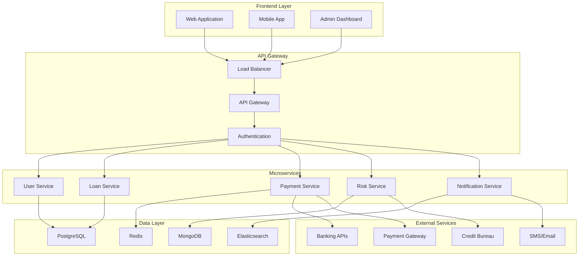

# 🏦 Hệ Thống Công Nghệ Cho Vay Ngang Hàng P2P Lending Việt Nam

## 📋 **TỔNG QUAN P2P LENDING VIỆT NAM**

### **Định nghĩa P2P Lending**
Cho vay ngang hàng (Peer-to-Peer Lending) là mô hình kết nối trực tiếp người vay và người cho vay thông qua nền tảng công nghệ số, cho phép giao dịch tài chính diễn ra mà không cần qua trung gian tài chính truyền thống.

### **Đặc điểm chính**
- **Kết nối trực tiếp**: Người vay và người cho vay giao dịch trực tiếp
- **Công nghệ số**: Sử dụng nền tảng online và mobile
- **Tự động hóa**: AI và Big Data trong thẩm định
- **Minh bạch**: Thông tin rõ ràng về lãi suất, phí
- **Linh hoạt**: Điều kiện vay đa dạng, thời gian nhanh

---

## 🏢 **CÁC NỀN TẢNG P2P LENDING HÀNG ĐẦU VIỆT NAM**

### **1. TIMA - Tiên phong P2P Lending**

#### **Thông tin cơ bản**
- **Thành lập**: 2015
- **Định giá**: 500 tỷ đồng
- **Vốn gọi**: 3 triệu USD từ Belt Road Capital Management
- **Đối tác**: Vietinbank Insurance, Nam Á Bank

#### **Sản phẩm dịch vụ**
- **Vay theo cavet**: Xe máy, xe ô tô
- **Vay tiêu dùng online**: Không cần tài sản thế chấp
- **Vay ứng lương**: Cho nhân viên
- **Vay doanh nghiệp**: SME và hộ kinh doanh

#### **Thông số kỹ thuật**
- **Lãi suất**: 1,3%/tháng (15,6%/năm)
- **Hạn mức**: 3-50 triệu đồng
- **Thời gian giải ngân**: 2 giờ
- **Quy trình**: 100% online

#### **Công nghệ sử dụng**
```yaml
Frontend:
  - React.js/React Native
  - Progressive Web App (PWA)
  - Mobile-first design

Backend:
  - Node.js/Express
  - Microservices architecture
  - RESTful API

Database:
  - PostgreSQL (primary)
  - Redis (caching)
  - MongoDB (documents)

AI/ML:
  - Credit scoring algorithms
  - Risk assessment models
  - Fraud detection
  - Automated underwriting

Security:
  - OAuth 2.0
  - JWT tokens
  - SSL/TLS encryption
  - PCI DSS compliance
```

### **2. FIIN CREDIT - AI-Powered Platform**

#### **Thông tin cơ bản**
- **Thành lập**: 2018
- **Công ty**: CP Đổi Mới Công Nghệ Tài Chính Fiin
- **Giải thưởng**: Top 10 thương hiệu uy tín 2019-2020
- **Đặc điểm**: Tích hợp AI và Big Data

#### **Sản phẩm dịch vụ**
- **Vay cá nhân**: Tiêu dùng, cấp bách
- **Vay doanh nghiệp**: SME, startup
- **Đầu tư**: Kết nối nhà đầu tư
- **Quản lý**: Ứng dụng di động

#### **Thông số kỹ thuật**
- **Lãi suất**: 12-18%/năm
- **Hạn mức**: 1-30 triệu đồng
- **Thời gian duyệt**: Tự động bằng AI
- **Quản lý**: Mobile app

#### **Công nghệ AI/ML**
```yaml
Machine Learning:
  - Credit scoring models
  - Risk prediction algorithms
  - Behavioral analysis
  - Pattern recognition

Big Data:
  - Data lake architecture
  - Real-time processing
  - Data analytics
  - Business intelligence

AI Features:
  - Automated underwriting
  - Fraud detection
  - Customer segmentation
  - Dynamic pricing

Data Sources:
  - Bank statements
  - Social media data
  - Mobile app usage
  - External APIs
```

### **3. VNVON - SME Focused Platform**

#### **Thông tin cơ bản**
- **Thành lập**: 2017
- **Đối tượng**: Doanh nghiệp nhỏ và vừa (SME)
- **Nhà đầu tư**: 10,000+ người
- **Doanh nghiệp**: Hàng trăm SME

#### **Sản phẩm dịch vụ**
- **Vay SME**: Không cần tài sản thế chấp
- **Đầu tư**: Kết nối nhà đầu tư với SME
- **Tư vấn**: Hỗ trợ doanh nghiệp
- **Bảo hiểm**: Bảo vệ nhà đầu tư

#### **Thông số kỹ thuật**
- **Lãi suất**: 15-20%/năm
- **Hạn mức**: 100 triệu - 1 tỷ đồng
- **Kỳ hạn**: 10-90 ngày
- **Đối tượng**: SME, hộ kinh doanh

#### **Công nghệ nền tảng**
```yaml
Architecture:
  - Microservices
  - Cloud-native
  - API-first design
  - Event-driven

Integration:
  - Banking APIs
  - Payment gateways
  - Credit bureaus
  - Government databases

Analytics:
  - Business intelligence
  - Risk analytics
  - Performance monitoring
  - Customer insights

Security:
  - Multi-factor authentication
  - Data encryption
  - Audit trails
  - Compliance monitoring
```

### **4. LENDBIZ - Business Lending Specialist**

#### **Thông tin cơ bản**
- **Thành lập**: 2017
- **Tập trung**: Doanh nghiệp nhỏ và hộ kinh doanh
- **Giải ngân**: 200+ tỷ đồng (2020)
- **Nhà đầu tư**: 3,000+ người
- **Doanh nghiệp**: 500+ doanh nghiệp

#### **Đối tác chiến lược**
- **PG Bank**: Xử lý thanh toán
- **VIB**: Dịch vụ ngân hàng
- **Bảo Việt Insurance**: Bảo hiểm rủi ro

#### **Thông số kỹ thuật**
- **Lãi suất**: 12-16%/năm
- **Hạn mức**: Lên đến 500 triệu đồng
- **Đối tượng**: SME, hộ kinh doanh
- **Bảo hiểm**: Có bảo hiểm rủi ro

#### **Công nghệ hệ thống**
```yaml
Core Platform:
  - Java Spring Boot
  - Angular/React frontend
  - PostgreSQL database
  - Redis caching

Payment Processing:
  - Bank integration
  - Real-time settlement
  - Multi-currency support
  - Fraud prevention

Risk Management:
  - Credit scoring
  - Portfolio analytics
  - Stress testing
  - Regulatory reporting

Compliance:
  - KYC/AML automation
  - Audit trails
  - Data protection
  - Regulatory compliance
```

### **5. LENDER.VN - Community Funding**

#### **Thông tin cơ bản**
- **Thành lập**: 2016
- **Mô hình**: Gọi vốn cộng đồng
- **Đối tượng**: Hộ kinh doanh, doanh nghiệp
- **Đặc điểm**: Đội ngũ giàu kinh nghiệm

#### **Sản phẩm dịch vụ**
- **Crowdfunding**: Gọi vốn cộng đồng
- **P2P Lending**: Cho vay ngang hàng
- **Tư vấn**: Hỗ trợ doanh nghiệp
- **Quản lý**: Hệ thống quản lý rủi ro

#### **Công nghệ nền tảng**
```yaml
Technology Stack:
  - PHP/Laravel backend
  - Vue.js frontend
  - MySQL database
  - AWS cloud infrastructure

Features:
  - User management
  - Loan origination
  - Payment processing
  - Risk assessment
  - Reporting dashboard

Integration:
  - Banking systems
  - Payment gateways
  - Credit bureaus
  - Government portals
```

---

## 🏗️ **KIẾN TRÚC CÔNG NGHỆ P2P LENDING**

### **1. Kiến trúc tổng thể**



### **2. Microservices Architecture**

#### **Core Services**
```yaml
User Management Service:
  - User registration/login
  - Profile management
  - KYC/AML verification
  - Role-based access control

Loan Origination Service:
  - Loan application
  - Document management
  - Credit assessment
  - Loan approval/rejection

Payment Processing Service:
  - Payment gateway integration
  - Transaction processing
  - Settlement management
  - Refund handling

Risk Management Service:
  - Credit scoring
  - Fraud detection
  - Portfolio analytics
  - Risk monitoring

Notification Service:
  - Email notifications
  - SMS alerts
  - Push notifications
  - In-app messages

Reporting Service:
  - Financial reports
  - Compliance reports
  - Analytics dashboards
  - Data export
```

### **3. Data Architecture**

#### **Database Design**
```yaml
Primary Database (PostgreSQL):
  - User accounts
  - Loan applications
  - Payment transactions
  - Financial records
  - Audit logs

Cache Layer (Redis):
  - Session management
  - API response caching
  - Rate limiting
  - Real-time data

Document Store (MongoDB):
  - User documents
  - Loan agreements
  - Communication logs
  - Configuration data

Search Engine (Elasticsearch):
  - Full-text search
  - Analytics queries
  - Log aggregation
  - Business intelligence
```

---

## 🤖 **CÔNG NGHỆ AI/ML TRONG P2P LENDING**

### **1. Credit Scoring Models**

#### **Traditional Credit Scoring**
```yaml
Factors:
  - Credit history
  - Income verification
  - Employment status
  - Debt-to-income ratio
  - Payment history

Algorithms:
  - Logistic regression
  - Decision trees
  - Random forest
  - Gradient boosting

Data Sources:
  - Bank statements
  - Credit bureau data
  - Employment records
  - Tax returns
```

#### **Alternative Credit Scoring**
```yaml
Alternative Data:
  - Mobile phone usage
  - Social media activity
  - E-commerce behavior
  - Utility payments
  - Rental history

ML Models:
  - Neural networks
  - Deep learning
  - Ensemble methods
  - Time series analysis

Features:
  - Behavioral patterns
  - Digital footprint
  - Network analysis
  - Psychometric data
```

### **2. Fraud Detection**

#### **Real-time Fraud Prevention**
```yaml
Detection Methods:
  - Rule-based systems
  - Machine learning models
  - Behavioral analysis
  - Device fingerprinting

ML Algorithms:
  - Anomaly detection
  - Classification models
  - Clustering algorithms
  - Deep learning

Risk Indicators:
  - Unusual transaction patterns
  - Suspicious device usage
  - Identity verification failures
  - High-risk geolocations
```

### **3. Automated Underwriting**

#### **AI-Powered Decision Making**
```yaml
Automation Levels:
  - Fully automated (low risk)
  - Semi-automated (medium risk)
  - Manual review (high risk)

Decision Factors:
  - Credit score
  - Income stability
  - Loan purpose
  - Collateral value
  - Market conditions

Processing Time:
  - Automated: < 5 minutes
  - Semi-automated: < 30 minutes
  - Manual: < 2 hours
```

---

## 🔒 **BẢO MẬT VÀ TUÂN THỦ**

### **1. Security Framework**

#### **Multi-layered Security**
```yaml
Application Security:
  - OAuth 2.0/OIDC
  - JWT tokens
  - API rate limiting
  - Input validation
  - SQL injection prevention

Infrastructure Security:
  - SSL/TLS encryption
  - VPN access
  - Firewall rules
  - Intrusion detection
  - DDoS protection

Data Security:
  - Encryption at rest
  - Encryption in transit
  - Data masking
  - Backup encryption
  - Key management

Operational Security:
  - Access controls
  - Audit logging
  - Security monitoring
  - Incident response
  - Regular security audits
```

### **2. Compliance Requirements**

#### **Regulatory Compliance**
```yaml
Vietnamese Regulations:
  - Banking Law
  - Consumer Protection Law
  - Data Protection Law
  - Anti-Money Laundering Law
  - Cybersecurity Law

International Standards:
  - PCI DSS (Payment Card Industry)
  - ISO 27001 (Information Security)
  - SOC 2 (Service Organization Control)
  - GDPR (General Data Protection Regulation)

Compliance Features:
  - KYC/AML automation
  - Transaction monitoring
  - Suspicious activity reporting
  - Data retention policies
  - Privacy protection
```

### **3. Risk Management**

#### **Comprehensive Risk Framework**
```yaml
Credit Risk:
  - Credit scoring models
  - Portfolio diversification
  - Stress testing
  - Default prediction
  - Recovery strategies

Operational Risk:
  - System failures
  - Process errors
  - Human errors
  - External events
  - Business continuity

Market Risk:
  - Interest rate changes
  - Economic conditions
  - Regulatory changes
  - Competition
  - Technology disruption

Liquidity Risk:
  - Cash flow management
  - Funding sources
  - Asset-liability matching
  - Contingency planning
  - Stress testing
```

---

## 📊 **ANALYTICS VÀ BUSINESS INTELLIGENCE**

### **1. Real-time Analytics**

#### **Dashboard Metrics**
```yaml
Operational Metrics:
  - Loan applications
  - Approval rates
  - Processing times
  - Customer satisfaction
  - System performance

Financial Metrics:
  - Loan volume
  - Interest income
  - Default rates
  - Profit margins
  - Return on investment

Risk Metrics:
  - Credit risk scores
  - Portfolio quality
  - Concentration risk
  - Stress test results
  - Early warning indicators

Customer Metrics:
  - Customer acquisition
  - Retention rates
  - Lifetime value
  - Churn analysis
  - Satisfaction scores
```

### **2. Predictive Analytics**

#### **Machine Learning Models**
```yaml
Predictive Models:
  - Default prediction
  - Customer churn
  - Market trends
  - Demand forecasting
  - Price optimization

Data Sources:
  - Historical loan data
  - Customer behavior
  - Economic indicators
  - Market data
  - External factors

Model Performance:
  - Accuracy metrics
  - Precision/Recall
  - ROC curves
  - Model validation
  - A/B testing
```

---

## 🚀 **XU HƯỚNG CÔNG NGHỆ TƯƠNG LAI**

### **1. Emerging Technologies**

#### **Blockchain và Smart Contracts**
```yaml
Blockchain Applications:
  - Smart contracts for loans
  - Decentralized identity
  - Cross-border payments
  - Asset tokenization
  - Transparent transactions

Benefits:
  - Reduced intermediaries
  - Lower transaction costs
  - Increased transparency
  - Faster settlements
  - Enhanced security

Implementation:
  - Ethereum-based contracts
  - Hyperledger Fabric
  - Corda platform
  - Custom blockchain solutions
```

#### **Open Banking và API Economy**
```yaml
Open Banking Features:
  - Account aggregation
  - Payment initiation
  - Data sharing
  - Third-party integration
  - Real-time payments

API Strategy:
  - RESTful APIs
  - GraphQL
  - Webhooks
  - SDK development
  - Developer portal

Partnerships:
  - Bank partnerships
  - Fintech collaborations
  - Technology providers
  - Data providers
  - Service integrators
```

### **2. Advanced AI/ML**

#### **Next-Generation AI**
```yaml
Advanced ML:
  - Deep learning models
  - Natural language processing
  - Computer vision
  - Reinforcement learning
  - Federated learning

AI Applications:
  - Conversational AI
  - Document processing
  - Image recognition
  - Sentiment analysis
  - Predictive maintenance

Automation:
  - Robotic process automation
  - Intelligent document processing
  - Automated decision making
  - Self-healing systems
  - Autonomous operations
```

---

## 📈 **THỐNG KÊ VÀ XU HƯỚNG THỊ TRƯỜNG**

### **1. Market Size và Growth**

#### **Quy mô thị trường**
```yaml
Market Statistics (2024):
  - Tổng giá trị: 2-3 tỷ USD
  - Tăng trưởng: 25-30%/năm
  - Số nền tảng: 50+ platforms
  - Người dùng: 2-3 triệu người
  - Giao dịch: 10+ tỷ VND/tháng

Growth Drivers:
  - Digital transformation
  - Mobile penetration
  - Financial inclusion
  - SME funding needs
  - Technology adoption

Market Segments:
  - Consumer lending: 60%
  - SME lending: 30%
  - Invoice financing: 10%
```

### **2. Competitive Landscape**

#### **Market Leaders**
```yaml
Top Players:
  1. Tima: Market leader, 500B VND valuation
  2. Fiin Credit: AI-powered, strong growth
  3. VNVON: SME focused, 10K+ investors
  4. Lendbiz: Business lending, 200B+ disbursed
  5. Lender.vn: Community funding

Competitive Advantages:
  - Technology innovation
  - Risk management
  - Customer experience
  - Regulatory compliance
  - Partnership network
```

---

## 🎯 **KHUYẾN NGHỊ VÀ TRIỂN VỌNG**

### **1. Cơ hội phát triển**

#### **Market Opportunities**
```yaml
Growth Areas:
  - SME lending expansion
  - Rural market penetration
  - Cross-border lending
  - Asset-backed lending
  - Green finance

Technology Trends:
  - AI/ML advancement
  - Blockchain integration
  - Open banking adoption
  - Mobile-first approach
  - API economy growth

Regulatory Support:
  - Sandbox programs
  - Regulatory clarity
  - Industry standards
  - Consumer protection
  - Risk management
```

### **2. Thách thức và rủi ro**

#### **Key Challenges**
```yaml
Regulatory Challenges:
  - Evolving regulations
  - Compliance costs
  - Cross-border issues
  - Data protection
  - Consumer protection

Technology Risks:
  - Cybersecurity threats
  - System failures
  - Data breaches
  - Technology obsolescence
  - Integration complexity

Market Risks:
  - Economic downturns
  - Credit risk
  - Competition
  - Customer acquisition
  - Funding challenges
```

### **3. Triển vọng tương lai**

#### **Future Outlook**
```yaml
Short-term (1-2 years):
  - Market consolidation
  - Technology advancement
  - Regulatory clarity
  - Increased adoption
  - Better risk management

Medium-term (3-5 years):
  - Market maturity
  - International expansion
  - Advanced AI/ML
  - Blockchain adoption
  - Open banking integration

Long-term (5+ years):
  - Market leadership
  - Global presence
  - Technology innovation
  - Ecosystem development
  - Industry transformation
```

---

## 📚 **TÀI LIỆU THAM KHẢO**

### **Nguồn thông tin**
- [Top Đầu Doanh Nghiệp](https://topdaudoanhnghiep.com/cong-ty-cho-vay-ngang-hang.html)
- [Lender.vn](https://lender.vn/danh-sach-cac-nen-tang-cho-vay-ngang-hang-doanh-nghiep-va-ho-kinh-doanh-tai-viet-nam.html)
- [Tima.vn](https://tima.vn/tin-tuc/vay-ngang-hang-tren-the-gioi-va-thuc-tien-tai-viet-nam-461.html)
- [VietnamPlus](https://www.vietnamplus.vn/ngan-hang-nha-nuoc-khuyen-cao-ve-cho-vay-ngang-hang-tai-viet-nam-post543764.vnp)

### **Công nghệ và tiêu chuẩn**
- PCI DSS Compliance
- ISO 27001 Information Security
- SOC 2 Service Organization Control
- OAuth 2.0/OIDC Authentication
- RESTful API Design

---

*Cập nhật lần cuối: Tháng 12/2024*
*Phiên bản: 1.0*
*Trạng thái: Tổng hợp đầy đủ*
