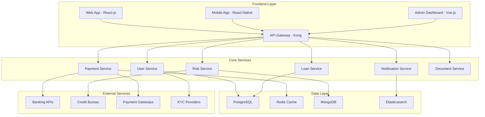

# 🚀 CÔNG NGHỆ KHUYẾN NGHỊ CHO HỆ THỐNG P2P LENDING

## 📋 TỔNG QUAN

Dựa trên phân tích chi tiết về thị trường P2P Lending tại Việt Nam và các nền tảng hàng đầu, tài liệu này đưa ra các khuyến nghị công nghệ toàn diện cho việc xây dựng một nền tảng P2P Lending hiện đại, có khả năng mở rộng và tuân thủ pháp lý.

---

## 🏗️ KIẾN TRÚC TỔNG THỂ

### **1. Microservices Architecture**



---

## 💻 FRONTEND TECHNOLOGY STACK

### **1. Web Application**

#### **Primary Framework: React.js 18+**
```yaml
Core Framework:
  - React 18.2+ with Concurrent Features
  - TypeScript 5.0+ for type safety
  - Next.js 14+ for SSR/SSG capabilities

State Management:
  - Redux Toolkit (RTK) for global state
  - React Query for server state
  - Zustand for lightweight state

UI Framework:
  - Ant Design 5.x (primary)
  - Material-UI (MUI) 5.x (alternative)
  - Tailwind CSS for custom styling

Development Tools:
  - Vite for fast development
  - ESLint + Prettier for code quality
  - Husky for git hooks
  - Storybook for component development
```

#### **Mobile Application: React Native**
```yaml
Core Framework:
  - React Native 0.72+
  - TypeScript for type safety
  - Expo SDK 49+ for rapid development

Navigation:
  - React Navigation 6.x
  - Deep linking support

State Management:
  - Redux Toolkit
  - AsyncStorage for persistence

UI Components:
  - NativeBase or React Native Elements
  - Custom components with native feel

Features:
  - Biometric authentication
  - Push notifications
  - Offline capability
  - Camera integration for document capture
```

### **2. Progressive Web App (PWA)**
```yaml
PWA Features:
  - Service Workers for offline functionality
  - Web App Manifest
  - Push notifications
  - Background sync
  - Install prompts

Performance:
  - Code splitting
  - Lazy loading
  - Image optimization
  - Caching strategies
```

---

## 🔧 BACKEND TECHNOLOGY STACK

### **1. Core Backend: Node.js + Express**

#### **Primary Stack**
```yaml
Runtime: Node.js 20+ LTS
Framework: Express.js 4.18+
Language: TypeScript 5.0+
Process Manager: PM2

Key Libraries:
  - Express.js: Web framework
  - Helmet: Security middleware
  - CORS: Cross-origin resource sharing
  - Morgan: HTTP request logger
  - Winston: Logging library
  - Joi: Data validation
  - Bcrypt: Password hashing
  - JWT: Token-based authentication
```

#### **Alternative: Java Spring Boot**
```yaml
Framework: Spring Boot 3.2+
Language: Java 17+
Build Tool: Maven or Gradle

Key Dependencies:
  - Spring Security: Authentication & authorization
  - Spring Data JPA: Database access
  - Spring Cloud: Microservices
  - Spring Boot Actuator: Monitoring
  - MapStruct: Object mapping
  - Lombok: Code generation
```

### **2. API Gateway & Management**

#### **Kong Gateway**
```yaml
Features:
  - API routing and load balancing
  - Rate limiting and throttling
  - Authentication and authorization
  - Request/response transformation
  - Analytics and monitoring
  - Plugin ecosystem

Configuration:
  - Kong Admin API
  - Konga for GUI management
  - Kong Ingress Controller for Kubernetes
```

#### **Alternative: AWS API Gateway**
```yaml
Features:
  - Serverless API management
  - Built-in authentication
  - Request/response transformation
  - API versioning
  - Usage plans and throttling
  - Integration with AWS services
```

---

## 🗄️ DATABASE TECHNOLOGY STACK

### **1. Primary Database: PostgreSQL 15+**

#### **Configuration**
```yaml
Version: PostgreSQL 15+
Extensions:
  - pgcrypto: Encryption functions
  - pg_stat_statements: Query statistics
  - pg_partman: Table partitioning
  - PostGIS: Geographic data (if needed)

Performance:
  - Connection pooling with PgBouncer
  - Read replicas for scaling
  - Automated backups
  - Point-in-time recovery
```

#### **Database Design Patterns**
```yaml
Schema Design:
  - Normalized structure for transactional data
  - Denormalized views for reporting
  - Partitioning for large tables
  - Indexing strategy for performance

Data Types:
  - UUID for primary keys
  - JSONB for flexible data
  - ENUM for status fields
  - TIMESTAMPTZ for timezone-aware dates
```

### **2. Cache Layer: Redis 7+**

#### **Redis Configuration**
```yaml
Use Cases:
  - Session storage
  - API response caching
  - Rate limiting
  - Real-time data
  - Pub/Sub messaging

Configuration:
  - Redis Cluster for high availability
  - Redis Sentinel for failover
  - Memory optimization
  - Persistence configuration
```

### **3. Document Store: MongoDB 6+**

#### **MongoDB Setup**
```yaml
Use Cases:
  - User documents storage
  - Loan agreements
  - Communication logs
  - Configuration data

Configuration:
  - MongoDB Atlas for managed service
  - Replica sets for high availability
  - Sharding for horizontal scaling
  - GridFS for large files
```

### **4. Search Engine: Elasticsearch 8+**

#### **Elasticsearch Configuration**
```yaml
Use Cases:
  - Full-text search
  - Log aggregation
  - Analytics queries
  - Real-time monitoring

Configuration:
  - Elastic Cloud for managed service
  - Index templates
  - Mapping optimization
  - Query performance tuning
```

---

## 🤖 AI/ML TECHNOLOGY STACK

### **1. Machine Learning Framework**

#### **Primary: Python + TensorFlow/PyTorch**
```yaml
Core Framework:
  - Python 3.11+
  - TensorFlow 2.13+ or PyTorch 2.0+
  - Scikit-learn 1.3+
  - Pandas 2.0+
  - NumPy 1.24+

ML Libraries:
  - XGBoost: Gradient boosting
  - LightGBM: Light gradient boosting
  - CatBoost: Categorical boosting
  - Optuna: Hyperparameter optimization
  - MLflow: Model lifecycle management

Data Processing:
  - Apache Spark: Big data processing
  - Apache Airflow: Workflow orchestration
  - Apache Kafka: Real-time streaming
```

#### **MLOps Pipeline**
```yaml
Model Development:
  - Jupyter Notebooks
  - Google Colab or Kaggle
  - DVC: Data version control
  - Weights & Biases: Experiment tracking

Model Deployment:
  - TensorFlow Serving
  - TorchServe
  - MLflow Model Registry
  - Kubernetes for scaling

Monitoring:
  - Model drift detection
  - Performance monitoring
  - A/B testing framework
```

### **2. Credit Scoring Models**

#### **Traditional Credit Scoring**
```yaml
Algorithms:
  - Logistic Regression
  - Random Forest
  - Gradient Boosting
  - Support Vector Machines

Features:
  - Credit history
  - Income stability
  - Employment status
  - Debt-to-income ratio
  - Payment history
```

#### **Alternative Credit Scoring**
```yaml
Data Sources:
  - Mobile phone usage patterns
  - Social media behavior
  - E-commerce transaction history
  - Utility payment history
  - Digital footprint analysis

Models:
  - Neural Networks
  - Deep Learning
  - Ensemble Methods
  - Time Series Analysis
```

### **3. Fraud Detection System**

#### **Real-time Fraud Prevention**
```yaml
Detection Methods:
  - Rule-based systems
  - Machine learning models
  - Behavioral analysis
  - Device fingerprinting
  - Network analysis

Technologies:
  - Apache Kafka: Real-time streaming
  - Apache Flink: Stream processing
  - Redis: Real-time caching
  - Elasticsearch: Pattern matching
```

---

## 🔒 SECURITY TECHNOLOGY STACK

### **1. Authentication & Authorization**

#### **OAuth 2.0 + OpenID Connect**
```yaml
Identity Provider:
  - Auth0 (managed service)
  - Keycloak (open source)
  - AWS Cognito (AWS ecosystem)

Features:
  - Multi-factor authentication (MFA)
  - Single Sign-On (SSO)
  - Social login integration
  - Role-based access control (RBAC)
  - JWT token management
```

#### **API Security**
```yaml
Security Measures:
  - API key management
  - Rate limiting
  - Request validation
  - CORS configuration
  - HTTPS enforcement
  - Input sanitization
```

### **2. Data Protection**

#### **Encryption**
```yaml
At Rest:
  - AES-256 encryption
  - Database-level encryption
  - File system encryption
  - Key management with AWS KMS

In Transit:
  - TLS 1.3
  - Certificate management
  - Perfect Forward Secrecy
  - HSTS headers
```

#### **Key Management**
```yaml
Solutions:
  - AWS Key Management Service (KMS)
  - HashiCorp Vault
  - Azure Key Vault
  - Google Cloud KMS

Features:
  - Key rotation
  - Hardware security modules (HSM)
  - Audit logging
  - Access controls
```

### **3. Security Monitoring**

#### **SIEM & Monitoring**
```yaml
SIEM Solutions:
  - Splunk Enterprise Security
  - IBM QRadar
  - Elastic Security
  - Azure Sentinel

Monitoring Tools:
  - Prometheus + Grafana
  - ELK Stack (Elasticsearch, Logstash, Kibana)
  - DataDog
  - New Relic
```

---

## ☁️ CLOUD INFRASTRUCTURE

### **1. Cloud Platform: AWS (Primary)**

#### **AWS Services**
```yaml
Compute:
  - Amazon EKS: Kubernetes service
  - Amazon ECS: Container service
  - AWS Lambda: Serverless functions
  - Amazon EC2: Virtual machines

Storage:
  - Amazon S3: Object storage
  - Amazon EBS: Block storage
  - Amazon EFS: File storage
  - Amazon RDS: Managed databases

Networking:
  - Amazon VPC: Virtual private cloud
  - Amazon CloudFront: CDN
  - AWS WAF: Web application firewall
  - Amazon Route 53: DNS service

Security:
  - AWS IAM: Identity and access management
  - AWS KMS: Key management
  - AWS Secrets Manager: Secrets management
  - AWS Certificate Manager: SSL certificates
```

#### **Alternative: Google Cloud Platform**
```yaml
Compute:
  - Google Kubernetes Engine (GKE)
  - Cloud Run: Serverless containers
  - Compute Engine: Virtual machines

Storage:
  - Cloud Storage: Object storage
  - Cloud SQL: Managed databases
  - Firestore: NoSQL database

AI/ML:
  - Vertex AI: ML platform
  - AutoML: Automated ML
  - BigQuery: Data warehouse
```

### **2. Container Orchestration: Kubernetes**

#### **Kubernetes Setup**
```yaml
Cluster Management:
  - Amazon EKS or Google GKE
  - kubectl for cluster management
  - Helm for package management

Deployment:
  - Rolling updates
  - Blue-green deployments
  - Canary deployments
  - Auto-scaling (HPA/VPA)

Monitoring:
  - Prometheus + Grafana
  - Jaeger for distributed tracing
  - Fluentd for log aggregation
```

---

## 🔄 DEVOPS & CI/CD

### **1. CI/CD Pipeline**

#### **GitLab CI/CD (Recommended)**
```yaml
Pipeline Stages:
  - Build: Compile and package
  - Test: Unit, integration, e2e tests
  - Security: SAST, DAST, dependency scanning
  - Deploy: Staging and production
  - Monitor: Health checks and alerts

Tools:
  - GitLab Runner
  - Docker for containerization
  - Kubernetes for orchestration
  - Helm for deployment
```

#### **Alternative: GitHub Actions**
```yaml
Features:
  - Native GitHub integration
  - Marketplace for actions
  - Matrix builds
  - Environment secrets
  - Deployment protection rules
```

### **2. Infrastructure as Code**

#### **Terraform**
```yaml
Use Cases:
  - Cloud resource provisioning
  - Environment management
  - State management
  - Module reusability

Structure:
  - terraform/
    - environments/
      - dev/
      - staging/
      - prod/
    - modules/
    - shared/
```

#### **Ansible**
```yaml
Use Cases:
  - Configuration management
  - Application deployment
  - Server provisioning
  - Task automation

Playbooks:
  - Database setup
  - Application deployment
  - Security hardening
  - Monitoring setup
```

### **3. Monitoring & Observability**

#### **Application Monitoring**
```yaml
APM Tools:
  - New Relic
  - DataDog
  - AppDynamics
  - Elastic APM

Metrics:
  - Application performance
  - Business metrics
  - Infrastructure metrics
  - User experience metrics
```

#### **Log Management**
```yaml
ELK Stack:
  - Elasticsearch: Search and analytics
  - Logstash: Log processing
  - Kibana: Visualization
  - Beats: Data shippers

Alternative:
  - Splunk
  - Fluentd
  - Grafana Loki
```

---

## 📱 MOBILE DEVELOPMENT

### **1. Cross-Platform: React Native**

#### **React Native Stack**
```yaml
Core:
  - React Native 0.72+
  - TypeScript
  - Metro bundler

Navigation:
  - React Navigation 6.x
  - Deep linking
  - Tab navigation

State Management:
  - Redux Toolkit
  - React Query
  - AsyncStorage

UI Components:
  - NativeBase
  - React Native Elements
  - Custom components

Features:
  - Biometric authentication
  - Push notifications (Firebase)
  - Camera integration
  - Offline support
```

### **2. Native Development (Alternative)**

#### **iOS: Swift + SwiftUI**
```yaml
Language: Swift 5.9+
Framework: SwiftUI
Architecture: MVVM
Networking: URLSession + Combine
Database: Core Data or SQLite
```

#### **Android: Kotlin + Jetpack Compose**
```yaml
Language: Kotlin 1.9+
Framework: Jetpack Compose
Architecture: MVVM + Repository
Networking: Retrofit + OkHttp
Database: Room
```

---

## 🔌 INTEGRATION & APIs

### **1. Payment Gateway Integration**

#### **Vietnamese Payment Gateways**
```yaml
Primary:
  - VNPay: Most popular in Vietnam
  - MoMo: Mobile wallet
  - ZaloPay: Social payment
  - ViettelPay: Telecom payment

International:
  - Stripe: Global payment processing
  - PayPal: International payments
  - Square: Point of sale
```

#### **Banking Integration**
```yaml
Open Banking:
  - Napas Gateway
  - Direct bank APIs
  - Internet Banking integration
  - QR Code payments

International:
  - SWIFT network
  - ACH transfers
  - Wire transfers
```

### **2. Third-Party Services**

#### **KYC/Identity Verification**
```yaml
Vietnamese Providers:
  - VNPT eKYC
  - FPT.AI
  - VinBigData
  - Viettel AI

International:
  - Jumio
  - Onfido
  - Trulioo
  - AWS Rekognition
```

#### **Credit Bureau Integration**
```yaml
Vietnamese:
  - CIC Vietnam (Credit Information Center)
  - PCB (Personal Credit Bureau)

International:
  - Experian
  - Equifax
  - TransUnion
```

---

## 📊 ANALYTICS & BUSINESS INTELLIGENCE

### **1. Data Analytics Platform**

#### **Data Warehouse: BigQuery**
```yaml
Features:
  - Serverless data warehouse
  - SQL-based analytics
  - Real-time streaming
  - Machine learning integration

Data Pipeline:
  - Apache Airflow: Workflow orchestration
  - Apache Kafka: Real-time streaming
  - Apache Spark: Data processing
  - dbt: Data transformation
```

#### **Alternative: Snowflake**
```yaml
Features:
  - Cloud-native data platform
  - Multi-cloud support
  - Data sharing capabilities
  - Advanced analytics
```

### **2. Business Intelligence**

#### **Dashboard & Visualization**
```yaml
Tools:
  - Tableau: Advanced analytics
  - Power BI: Microsoft ecosystem
  - Looker: Google ecosystem
  - Grafana: Real-time monitoring

Custom Dashboards:
  - React + D3.js
  - Vue.js + Chart.js
  - Angular + Highcharts
```

---

## 🚀 PERFORMANCE OPTIMIZATION

### **1. Frontend Optimization**

#### **Performance Techniques**
```yaml
Code Splitting:
  - Dynamic imports
  - Route-based splitting
  - Component lazy loading

Caching:
  - Service Worker caching
  - HTTP caching
  - CDN caching
  - Browser caching

Optimization:
  - Image optimization
  - Bundle size optimization
  - Tree shaking
  - Dead code elimination
```

### **2. Backend Optimization**

#### **Performance Strategies**
```yaml
Caching:
  - Redis caching
  - Database query caching
  - API response caching
  - CDN caching

Database Optimization:
  - Query optimization
  - Index optimization
  - Connection pooling
  - Read replicas

Scalability:
  - Horizontal scaling
  - Load balancing
  - Auto-scaling
  - Microservices architecture
```

---

## 🔧 DEVELOPMENT TOOLS

### **1. Development Environment**

#### **IDE & Editors**
```yaml
Recommended:
  - Visual Studio Code
  - WebStorm (JetBrains)
  - IntelliJ IDEA (Java development)

Extensions:
  - ESLint
  - Prettier
  - GitLens
  - REST Client
  - Docker
```

#### **Version Control**
```yaml
Git Workflow:
  - GitFlow or GitHub Flow
  - Feature branches
  - Pull request reviews
  - Automated testing

Tools:
  - Git
  - GitHub/GitLab
  - GitKraken (GUI)
  - SourceTree (GUI)
```

### **2. Testing Framework**

#### **Frontend Testing**
```yaml
Unit Testing:
  - Jest: JavaScript testing
  - React Testing Library
  - Vue Test Utils
  - Cypress: E2E testing

Integration Testing:
  - Supertest: API testing
  - MSW: Mock Service Worker
  - TestContainers: Database testing
```

#### **Backend Testing**
```yaml
Unit Testing:
  - Jest (Node.js)
  - JUnit (Java)
  - pytest (Python)

Integration Testing:
  - Postman/Newman
  - REST Assured (Java)
  - Supertest (Node.js)
```

---

## 📋 DEPLOYMENT STRATEGY

### **1. Environment Strategy**

#### **Environment Setup**
```yaml
Development:
  - Local development
  - Docker Compose
  - Hot reloading
  - Debug tools

Staging:
  - Production-like environment
  - Integration testing
  - Performance testing
  - User acceptance testing

Production:
  - High availability
  - Auto-scaling
  - Monitoring
  - Backup & recovery
```

### **2. Deployment Methods**

#### **Blue-Green Deployment**
```yaml
Benefits:
  - Zero downtime
  - Quick rollback
  - Production testing
  - Risk mitigation

Implementation:
  - Load balancer switching
  - Database migration
  - Health checks
  - Rollback procedures
```

#### **Canary Deployment**
```yaml
Benefits:
  - Gradual rollout
  - Risk reduction
  - Real user testing
  - Performance monitoring

Implementation:
  - Traffic splitting
  - A/B testing
  - Metrics monitoring
  - Automatic rollback
```

---

## 🎯 KHUYẾN NGHỊ TRIỂN KHAI

### **1. Giai đoạn 1: MVP (3-6 tháng)**

#### **Core Features**
```yaml
Frontend:
  - React.js web application
  - Basic responsive design
  - User authentication
  - Loan application form

Backend:
  - Node.js + Express API
  - PostgreSQL database
  - Basic user management
  - Simple loan processing

Infrastructure:
  - AWS EC2 instances
  - RDS PostgreSQL
  - Basic monitoring
  - Manual deployment
```

### **2. Giai đoạn 2: Production Ready (6-12 tháng)**

#### **Enhanced Features**
```yaml
Frontend:
  - React Native mobile app
  - Advanced UI/UX
  - Real-time notifications
  - Dashboard analytics

Backend:
  - Microservices architecture
  - Redis caching
  - Payment integration
  - Risk assessment

Infrastructure:
  - Kubernetes cluster
  - CI/CD pipeline
  - Monitoring & logging
  - Auto-scaling
```

### **3. Giai đoạn 3: Scale & Optimize (12+ tháng)**

#### **Advanced Features**
```yaml
AI/ML:
  - Credit scoring models
  - Fraud detection
  - Predictive analytics
  - Automated underwriting

Advanced Infrastructure:
  - Multi-cloud deployment
  - Advanced monitoring
  - Disaster recovery
  - Performance optimization
```

---

## 💰 CHI PHÍ ƯỚC TÍNH

### **1. Development Costs**

#### **Team Structure**
```yaml
Core Team (6-8 months):
  - 1 Tech Lead: $3,000-5,000/month
  - 2 Backend Developers: $2,000-3,500/month each
  - 2 Frontend Developers: $2,000-3,500/month each
  - 1 DevOps Engineer: $2,500-4,000/month
  - 1 UI/UX Designer: $1,500-2,500/month
  - 1 QA Engineer: $1,500-2,500/month

Total Monthly: $12,500-22,000
Total 6 months: $75,000-132,000
```

### **2. Infrastructure Costs**

#### **AWS Monthly Costs (Production)**
```yaml
Compute:
  - EKS Cluster: $200-500
  - EC2 Instances: $500-1,500
  - Lambda Functions: $50-200

Storage:
  - RDS PostgreSQL: $300-800
  - S3 Storage: $100-300
  - EBS Volumes: $200-500

Networking:
  - CloudFront CDN: $100-300
  - Load Balancer: $50-150
  - Data Transfer: $100-500

Total Monthly: $1,600-4,750
Total Annual: $19,200-57,000
```

### **3. Third-Party Services**

#### **Monthly Service Costs**
```yaml
Payment Gateways:
  - VNPay: 0.5-1.5% per transaction
  - Stripe: 2.9% + $0.30 per transaction

KYC Services:
  - VNPT eKYC: $0.50-2.00 per verification
  - Jumio: $1.00-3.00 per verification

Monitoring:
  - DataDog: $200-1,000/month
  - New Relic: $100-500/month

Total Monthly: $500-2,000
```

---

## 🎯 KẾT LUẬN

### **✅ Công nghệ được khuyến nghị:**

1. **Frontend**: React.js + React Native + TypeScript
2. **Backend**: Node.js + Express + TypeScript
3. **Database**: PostgreSQL + Redis + MongoDB
4. **Cloud**: AWS với Kubernetes
5. **AI/ML**: Python + TensorFlow/PyTorch
6. **Security**: OAuth 2.0 + JWT + Encryption
7. **DevOps**: GitLab CI/CD + Terraform + Ansible

### **🚀 Lợi ích chính:**

- **Scalability**: Kiến trúc microservices có thể mở rộng
- **Security**: Bảo mật đa lớp với encryption và monitoring
- **Performance**: Tối ưu hóa với caching và CDN
- **Compliance**: Tuân thủ các quy định pháp lý Việt Nam
- **Cost-effective**: Sử dụng open source và cloud services
- **Future-proof**: Công nghệ hiện đại, dễ bảo trì và nâng cấp

### **📈 Roadmap triển khai:**

1. **MVP**: 3-6 tháng với core features
2. **Production**: 6-12 tháng với full features
3. **Scale**: 12+ tháng với AI/ML và optimization

Công nghệ stack này đảm bảo xây dựng một nền tảng P2P Lending hiện đại, có khả năng cạnh tranh và mở rộng trong thị trường Việt Nam.
