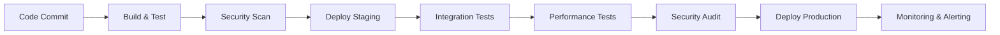

# DEVOPS PIPELINE WORKFLOW CHO HỆ THỐNG VÍ ĐIỆN TỬ VIỆT NAM

## TỔNG QUAN PIPELINE

Pipeline DevOps được thiết kế để đảm bảo chất lượng code, bảo mật cao và triển khai liên tục cho hệ thống ví điện tử với khả năng xử lý hàng triệu giao dịch mỗi ngày.

## 1. KIẾN TRÚC PIPELINE TỔNG THỂ

### 1.1 Pipeline Stages


### 1.2 Environment Strategy
- **Development**: Local development với Docker Compose
- **Staging**: Production-like environment cho testing
- **Production**: Multi-region deployment với high availability

## 2. CI/CD PIPELINE CHI TIẾT

### 2.1 GitLab CI/CD Configuration

```yaml
# .gitlab-ci.yml
stages:
  - build
  - test
  - security
  - deploy-staging
  - integration-test
  - performance-test
  - security-audit
  - deploy-production
  - monitoring

variables:
  DOCKER_DRIVER: overlay2
  DOCKER_TLS_CERTDIR: "/certs"
  REGISTRY: $CI_REGISTRY
  IMAGE_TAG: $CI_COMMIT_SHA

# Build Stage
build:
  stage: build
  image: docker:20.10.16
  services:
    - docker:20.10.16-dind
  script:
    - docker build -t $REGISTRY/$CI_PROJECT_NAME:$IMAGE_TAG .
    - docker push $REGISTRY/$CI_PROJECT_NAME:$IMAGE_TAG
  only:
    - main
    - develop
    - merge_requests

# Test Stage
test:
  stage: test
  image: node:20-alpine
  services:
    - postgres:15
    - redis:7-alpine
  before_script:
    - npm ci
    - npm run db:migrate
    - npm run db:seed
  script:
    - npm run test:unit
    - npm run test:integration
    - npm run test:e2e
    - npm run test:coverage
  coverage: '/Lines\s*:\s*(\d+\.\d+)%/'
  artifacts:
    reports:
      coverage_report:
        coverage_format: cobertura
        path: coverage/cobertura-coverage.xml
    paths:
      - coverage/
    expire_in: 1 week

# Security Scan Stage
security-scan:
  stage: security
  image: securecodewarrior/docker-security-scan:latest
  script:
    - docker run --rm -v /var/run/docker.sock:/var/run/docker.sock 
        securecodewarrior/docker-security-scan:latest 
        $REGISTRY/$CI_PROJECT_NAME:$IMAGE_TAG
  allow_failure: true

# SAST (Static Application Security Testing)
sast:
  stage: security
  image: securecodewarrior/sast-scan:latest
  script:
    - sast-scan --source . --output sast-report.json
  artifacts:
    reports:
      sast: sast-report.json
    expire_in: 1 week

# Deploy to Staging
deploy-staging:
  stage: deploy-staging
  image: bitnami/kubectl:latest
  script:
    - kubectl config use-context staging
    - helm upgrade --install ewallet-staging ./helm/ewallet 
        --namespace staging 
        --set image.tag=$IMAGE_TAG
        --set environment=staging
        --wait
  environment:
    name: staging
    url: https://staging.ewallet.vn
  only:
    - develop

# Integration Tests
integration-test:
  stage: integration-test
  image: node:20-alpine
  script:
    - npm run test:integration:staging
  dependencies:
    - deploy-staging
  only:
    - develop

# Performance Tests
performance-test:
  stage: performance-test
  image: grafana/k6:latest
  script:
    - k6 run --out json=performance-results.json tests/performance/load-test.js
  artifacts:
    reports:
      performance: performance-results.json
    expire_in: 1 week
  only:
    - develop

# Security Audit
security-audit:
  stage: security-audit
  image: securecodewarrior/security-audit:latest
  script:
    - security-audit --target https://staging.ewallet.vn
  artifacts:
    reports:
      security: security-audit-report.json
    expire_in: 1 week
  only:
    - develop

# Deploy to Production
deploy-production:
  stage: deploy-production
  image: bitnami/kubectl:latest
  script:
    - kubectl config use-context production
    - helm upgrade --install ewallet-prod ./helm/ewallet 
        --namespace production 
        --set image.tag=$IMAGE_TAG
        --set environment=production
        --set replicas=3
        --wait
  environment:
    name: production
    url: https://ewallet.vn
  when: manual
  only:
    - main

# Monitoring Setup
monitoring:
  stage: monitoring
  image: bitnami/kubectl:latest
  script:
    - kubectl apply -f monitoring/prometheus-config.yaml
    - kubectl apply -f monitoring/grafana-dashboards.yaml
  only:
    - main
```

### 2.2 GitHub Actions Alternative

```yaml
# .github/workflows/ci-cd.yml
name: CI/CD Pipeline

on:
  push:
    branches: [ main, develop ]
  pull_request:
    branches: [ main ]

env:
  REGISTRY: ghcr.io
  IMAGE_NAME: ${{ github.repository }}

jobs:
  build:
    runs-on: ubuntu-latest
    outputs:
      image: ${{ steps.image.outputs.image }}
    steps:
    - uses: actions/checkout@v4
    
    - name: Set up Docker Buildx
      uses: docker/setup-buildx-action@v3
    
    - name: Log in to Container Registry
      uses: docker/login-action@v3
      with:
        registry: ${{ env.REGISTRY }}
        username: ${{ github.actor }}
        password: ${{ secrets.GITHUB_TOKEN }}
    
    - name: Extract metadata
      id: meta
      uses: docker/metadata-action@v5
      with:
        images: ${{ env.REGISTRY }}/${{ env.IMAGE_NAME }}
        tags: |
          type=ref,event=branch
          type=ref,event=pr
          type=sha,prefix={{branch}}-
    
    - name: Build and push Docker image
      uses: docker/build-push-action@v5
      with:
        context: .
        push: true
        tags: ${{ steps.meta.outputs.tags }}
        labels: ${{ steps.meta.outputs.labels }}
        cache-from: type=gha
        cache-to: type=gha,mode=max
    
    - name: Output image
      id: image
      run: echo "image=${{ env.REGISTRY }}/${{ env.IMAGE_NAME }}:${{ github.sha }}" >> $GITHUB_OUTPUT

  test:
    runs-on: ubuntu-latest
    needs: build
    services:
      postgres:
        image: postgres:15
        env:
          POSTGRES_PASSWORD: postgres
          POSTGRES_DB: ewallet_test
        options: >-
          --health-cmd pg_isready
          --health-interval 10s
          --health-timeout 5s
          --health-retries 5
      redis:
        image: redis:7
        options: >-
          --health-cmd "redis-cli ping"
          --health-interval 10s
          --health-timeout 5s
          --health-retries 5
    
    steps:
    - uses: actions/checkout@v4
    
    - name: Set up Node.js
      uses: actions/setup-node@v4
      with:
        node-version: '20'
        cache: 'npm'
    
    - name: Install dependencies
      run: npm ci
    
    - name: Run tests
      run: |
        npm run test:unit
        npm run test:integration
        npm run test:e2e
    
    - name: Upload coverage to Codecov
      uses: codecov/codecov-action@v3
      with:
        file: ./coverage/lcov.info

  security:
    runs-on: ubuntu-latest
    needs: build
    steps:
    - uses: actions/checkout@v4
    
    - name: Run Trivy vulnerability scanner
      uses: aquasecurity/trivy-action@master
      with:
        image-ref: ${{ needs.build.outputs.image }}
        format: 'sarif'
        output: 'trivy-results.sarif'
    
    - name: Upload Trivy scan results to GitHub Security tab
      uses: github/codeql-action/upload-sarif@v2
      with:
        sarif_file: 'trivy-results.sarif'

  deploy-staging:
    runs-on: ubuntu-latest
    needs: [build, test, security]
    if: github.ref == 'refs/heads/develop'
    environment: staging
    
    steps:
    - uses: actions/checkout@v4
    
    - name: Configure kubectl
      uses: azure/k8s-set-context@v3
      with:
        method: kubeconfig
        kubeconfig: ${{ secrets.KUBE_CONFIG_STAGING }}
    
    - name: Deploy to staging
      run: |
        helm upgrade --install ewallet-staging ./helm/ewallet \
          --namespace staging \
          --set image.repository=${{ needs.build.outputs.image }} \
          --set environment=staging

  deploy-production:
    runs-on: ubuntu-latest
    needs: [build, test, security]
    if: github.ref == 'refs/heads/main'
    environment: production
    
    steps:
    - uses: actions/checkout@v4
    
    - name: Configure kubectl
      uses: azure/k8s-set-context@v3
      with:
        method: kubeconfig
        kubeconfig: ${{ secrets.KUBE_CONFIG_PRODUCTION }}
    
    - name: Deploy to production
      run: |
        helm upgrade --install ewallet-prod ./helm/ewallet \
          --namespace production \
          --set image.repository=${{ needs.build.outputs.image }} \
          --set environment=production \
          --set replicas=3
```

## 3. INFRASTRUCTURE AS CODE

### 3.1 Terraform Configuration

```hcl
# infrastructure/main.tf
terraform {
  required_version = ">= 1.0"
  required_providers {
    aws = {
      source  = "hashicorp/aws"
      version = "~> 5.0"
    }
    kubernetes = {
      source  = "hashicorp/kubernetes"
      version = "~> 2.0"
    }
  }
  
  backend "s3" {
    bucket = "ewallet-terraform-state"
    key    = "infrastructure/terraform.tfstate"
    region = "ap-southeast-1"
  }
}

provider "aws" {
  region = var.aws_region
}

# VPC Configuration
module "vpc" {
  source = "terraform-aws-modules/vpc/aws"
  
  name = "ewallet-vpc"
  cidr = "10.0.0.0/16"
  
  azs             = ["ap-southeast-1a", "ap-southeast-1b", "ap-southeast-1c"]
  private_subnets = ["10.0.1.0/24", "10.0.2.0/24", "10.0.3.0/24"]
  public_subnets  = ["10.0.101.0/24", "10.0.102.0/24", "10.0.103.0/24"]
  
  enable_nat_gateway = true
  enable_vpn_gateway = true
  
  tags = {
    Environment = var.environment
    Project     = "ewallet"
  }
}

# EKS Cluster
module "eks" {
  source = "terraform-aws-modules/eks/aws"
  
  cluster_name    = "ewallet-cluster"
  cluster_version = "1.28"
  
  vpc_id                         = module.vpc.vpc_id
  subnet_ids                     = module.vpc.private_subnets
  cluster_endpoint_public_access = true
  
  node_groups = {
    main = {
      desired_capacity = 3
      max_capacity     = 10
      min_capacity     = 1
      
      instance_types = ["t3.medium"]
      capacity_type  = "ON_DEMAND"
    }
    
    spot = {
      desired_capacity = 2
      max_capacity     = 5
      min_capacity     = 0
      
      instance_types = ["t3.medium", "t3.large"]
      capacity_type  = "SPOT"
    }
  }
  
  tags = {
    Environment = var.environment
    Project     = "ewallet"
  }
}

# RDS PostgreSQL
resource "aws_db_instance" "postgres" {
  identifier = "ewallet-postgres"
  
  engine         = "postgres"
  engine_version = "15.4"
  instance_class = "db.t3.medium"
  
  allocated_storage     = 100
  max_allocated_storage = 1000
  storage_type          = "gp3"
  storage_encrypted     = true
  
  db_name  = "ewallet"
  username = "ewallet"
  password = var.db_password
  
  vpc_security_group_ids = [aws_security_group.rds.id]
  db_subnet_group_name   = aws_db_subnet_group.main.name
  
  backup_retention_period = 7
  backup_window          = "03:00-04:00"
  maintenance_window     = "sun:04:00-sun:05:00"
  
  skip_final_snapshot = false
  final_snapshot_identifier = "ewallet-postgres-final-snapshot"
  
  tags = {
    Environment = var.environment
    Project     = "ewallet"
  }
}

# ElastiCache Redis
resource "aws_elasticache_replication_group" "redis" {
  replication_group_id       = "ewallet-redis"
  description                = "Redis cluster for ewallet"
  
  node_type            = "cache.t3.micro"
  port                 = 6379
  parameter_group_name = "default.redis7"
  
  num_cache_clusters = 2
  
  subnet_group_name = aws_elasticache_subnet_group.main.name
  security_group_ids = [aws_security_group.redis.id]
  
  at_rest_encryption_enabled = true
  transit_encryption_enabled = true
  
  tags = {
    Environment = var.environment
    Project     = "ewallet"
  }
}

# S3 Bucket for file storage
resource "aws_s3_bucket" "ewallet_storage" {
  bucket = "ewallet-storage-${var.environment}"
  
  tags = {
    Environment = var.environment
    Project     = "ewallet"
  }
}

resource "aws_s3_bucket_versioning" "ewallet_storage" {
  bucket = aws_s3_bucket.ewallet_storage.id
  versioning_configuration {
    status = "Enabled"
  }
}

resource "aws_s3_bucket_encryption" "ewallet_storage" {
  bucket = aws_s3_bucket.ewallet_storage.id
  
  server_side_encryption_configuration {
    rule {
      apply_server_side_encryption_by_default {
        sse_algorithm = "AES256"
      }
    }
  }
}
```

### 3.2 Helm Charts

```yaml
# helm/ewallet/Chart.yaml
apiVersion: v2
name: ewallet
description: Vietnam E-Wallet Exchange System
type: application
version: 1.0.0
appVersion: "1.0.0"

dependencies:
  - name: postgresql
    version: 12.x.x
    repository: https://charts.bitnami.com/bitnami
    condition: postgresql.enabled
  - name: redis
    version: 17.x.x
    repository: https://charts.bitnami.com/bitnami
    condition: redis.enabled
  - name: prometheus
    version: 25.x.x
    repository: https://prometheus-community.github.io/helm-charts
    condition: monitoring.prometheus.enabled
  - name: grafana
    version: 7.x.x
    repository: https://grafana.github.io/helm-charts
    condition: monitoring.grafana.enabled
```

```yaml
# helm/ewallet/values.yaml
replicaCount: 3

image:
  repository: ewallet/api
  pullPolicy: IfNotPresent
  tag: "latest"

service:
  type: ClusterIP
  port: 3000

ingress:
  enabled: true
  className: "nginx"
  annotations:
    cert-manager.io/cluster-issuer: "letsencrypt-prod"
    nginx.ingress.kubernetes.io/ssl-redirect: "true"
  hosts:
    - host: ewallet.vn
      paths:
        - path: /
          pathType: Prefix
  tls:
    - secretName: ewallet-tls
      hosts:
        - ewallet.vn

resources:
  limits:
    cpu: 1000m
    memory: 1Gi
  requests:
    cpu: 500m
    memory: 512Mi

autoscaling:
  enabled: true
  minReplicas: 3
  maxReplicas: 10
  targetCPUUtilizationPercentage: 70
  targetMemoryUtilizationPercentage: 80

postgresql:
  enabled: false
  auth:
    postgresPassword: "postgres"
    username: "ewallet"
    password: "ewallet"
    database: "ewallet"
  primary:
    persistence:
      enabled: true
      size: 100Gi

redis:
  enabled: false
  auth:
    enabled: true
    password: "redis"
  master:
    persistence:
      enabled: true
      size: 10Gi

monitoring:
  prometheus:
    enabled: true
  grafana:
    enabled: true
    adminPassword: "admin"
```

## 4. MONITORING & OBSERVABILITY

### 4.1 Prometheus Configuration

```yaml
# monitoring/prometheus-config.yaml
apiVersion: v1
kind: ConfigMap
metadata:
  name: prometheus-config
  namespace: monitoring
data:
  prometheus.yml: |
    global:
      scrape_interval: 15s
      evaluation_interval: 15s
    
    rule_files:
      - "rules/*.yml"
    
    scrape_configs:
      - job_name: 'kubernetes-pods'
        kubernetes_sd_configs:
          - role: pod
        relabel_configs:
          - source_labels: [__meta_kubernetes_pod_annotation_prometheus_io_scrape]
            action: keep
            regex: true
          - source_labels: [__meta_kubernetes_pod_annotation_prometheus_io_path]
            action: replace
            target_label: __metrics_path__
            regex: (.+)
      
      - job_name: 'kubernetes-nodes'
        kubernetes_sd_configs:
          - role: node
        relabel_configs:
          - action: labelmap
            regex: __meta_kubernetes_node_label_(.+)
      
      - job_name: 'kubernetes-cadvisor'
        kubernetes_sd_configs:
          - role: node
        scheme: https
        tls_config:
          ca_file: /var/run/secrets/kubernetes.io/serviceaccount/ca.crt
        bearer_token_file: /var/run/secrets/kubernetes.io/serviceaccount/token
        relabel_configs:
          - action: labelmap
            regex: __meta_kubernetes_node_label_(.+)
          - target_label: __address__
            replacement: kubernetes.default.svc:443
          - source_labels: [__meta_kubernetes_node_name]
            regex: (.+)
            target_label: __metrics_path__
            replacement: /api/v1/nodes/${1}/proxy/metrics/cadvisor
```

### 4.2 Grafana Dashboards

```json
{
  "dashboard": {
    "id": null,
    "title": "E-Wallet System Overview",
    "tags": ["ewallet", "monitoring"],
    "timezone": "browser",
    "panels": [
      {
        "id": 1,
        "title": "Request Rate",
        "type": "graph",
        "targets": [
          {
            "expr": "rate(http_requests_total[5m])",
            "legendFormat": "{{method}} {{endpoint}}"
          }
        ]
      },
      {
        "id": 2,
        "title": "Response Time",
        "type": "graph",
        "targets": [
          {
            "expr": "histogram_quantile(0.95, rate(http_request_duration_seconds_bucket[5m]))",
            "legendFormat": "95th percentile"
          }
        ]
      },
      {
        "id": 3,
        "title": "Error Rate",
        "type": "graph",
        "targets": [
          {
            "expr": "rate(http_requests_total{status=~\"5..\"}[5m])",
            "legendFormat": "5xx errors"
          }
        ]
      },
      {
        "id": 4,
        "title": "Database Connections",
        "type": "graph",
        "targets": [
          {
            "expr": "pg_stat_database_numbackends",
            "legendFormat": "Active connections"
          }
        ]
      }
    ]
  }
}
```

## 5. SECURITY PIPELINE

### 5.1 Security Scanning

```yaml
# security/security-pipeline.yml
stages:
  - security-scan
  - vulnerability-assessment
  - penetration-testing
  - compliance-check

security-scan:
  stage: security-scan
  image: securecodewarrior/security-scan:latest
  script:
    - security-scan --source . --output security-report.json
  artifacts:
    reports:
      security: security-report.json

vulnerability-assessment:
  stage: vulnerability-assessment
  image: aquasec/trivy:latest
  script:
    - trivy image --format json --output trivy-report.json $CI_REGISTRY_IMAGE:$CI_COMMIT_SHA
  artifacts:
    reports:
      vulnerability: trivy-report.json

penetration-testing:
  stage: penetration-testing
  image: securecodewarrior/penetration-test:latest
  script:
    - penetration-test --target $STAGING_URL --output pentest-report.json
  artifacts:
    reports:
      penetration: pentest-report.json
  only:
    - main

compliance-check:
  stage: compliance-check
  image: securecodewarrior/compliance-check:latest
  script:
    - compliance-check --standard pci-dss --output compliance-report.json
  artifacts:
    reports:
      compliance: compliance-report.json
```

### 5.2 Secrets Management

```yaml
# security/secrets-management.yml
apiVersion: v1
kind: Secret
metadata:
  name: ewallet-secrets
  namespace: ewallet
type: Opaque
data:
  database-password: <base64-encoded-password>
  redis-password: <base64-encoded-password>
  jwt-secret: <base64-encoded-secret>
  encryption-key: <base64-encoded-key>

---
apiVersion: external-secrets.io/v1beta1
kind: SecretStore
metadata:
  name: aws-secrets-manager
  namespace: ewallet
spec:
  provider:
    aws:
      service: SecretsManager
      region: ap-southeast-1
      auth:
        secretRef:
          accessKeyID:
            name: aws-credentials
            key: access-key-id
          secretAccessKey:
            name: aws-credentials
            key: secret-access-key

---
apiVersion: external-secrets.io/v1beta1
kind: ExternalSecret
metadata:
  name: ewallet-external-secrets
  namespace: ewallet
spec:
  refreshInterval: 1h
  secretStoreRef:
    name: aws-secrets-manager
    kind: SecretStore
  target:
    name: ewallet-secrets
    creationPolicy: Owner
  data:
    - secretKey: database-password
      remoteRef:
        key: ewallet/database
        property: password
    - secretKey: jwt-secret
      remoteRef:
        key: ewallet/jwt
        property: secret
```

## 6. DISASTER RECOVERY & BACKUP

### 6.1 Backup Strategy

```yaml
# backup/backup-pipeline.yml
apiVersion: batch/v1
kind: CronJob
metadata:
  name: database-backup
  namespace: ewallet
spec:
  schedule: "0 2 * * *"  # Daily at 2 AM
  jobTemplate:
    spec:
      template:
        spec:
          containers:
          - name: postgres-backup
            image: postgres:15
            env:
            - name: PGPASSWORD
              valueFrom:
                secretKeyRef:
                  name: ewallet-secrets
                  key: database-password
            command:
            - /bin/bash
            - -c
            - |
              pg_dump -h postgres-service -U ewallet -d ewallet | gzip > /backup/ewallet-$(date +%Y%m%d).sql.gz
              aws s3 cp /backup/ewallet-$(date +%Y%m%d).sql.gz s3://ewallet-backups/database/
            volumeMounts:
            - name: backup-storage
              mountPath: /backup
          volumes:
          - name: backup-storage
            emptyDir: {}
          restartPolicy: OnFailure

---
apiVersion: batch/v1
kind: CronJob
metadata:
  name: redis-backup
  namespace: ewallet
spec:
  schedule: "0 3 * * *"  # Daily at 3 AM
  jobTemplate:
    spec:
      template:
        spec:
          containers:
          - name: redis-backup
            image: redis:7
            command:
            - /bin/bash
            - -c
            - |
              redis-cli -h redis-service --rdb /backup/redis-$(date +%Y%m%d).rdb
              aws s3 cp /backup/redis-$(date +%Y%m%d).rdb s3://ewallet-backups/redis/
            volumeMounts:
            - name: backup-storage
              mountPath: /backup
          volumes:
          - name: backup-storage
            emptyDir: {}
          restartPolicy: OnFailure
```

### 6.2 Disaster Recovery Plan

```yaml
# disaster-recovery/dr-plan.yml
apiVersion: v1
kind: ConfigMap
metadata:
  name: disaster-recovery-plan
  namespace: ewallet
data:
  dr-procedures.md: |
    # Disaster Recovery Procedures
    
    ## RTO (Recovery Time Objective): 4 hours
    ## RPO (Recovery Point Objective): 1 hour
    
    ### 1. Database Recovery
    - Restore from latest backup
    - Apply WAL files for point-in-time recovery
    - Verify data integrity
    
    ### 2. Application Recovery
    - Deploy to secondary region
    - Update DNS records
    - Verify application functionality
    
    ### 3. Monitoring & Validation
    - Check all services are running
    - Verify transaction processing
    - Monitor error rates and performance
    
    ### 4. Communication
    - Notify stakeholders
    - Update status page
    - Document incident details
```

## 7. PERFORMANCE OPTIMIZATION

### 7.1 Auto-scaling Configuration

```yaml
# performance/autoscaling.yml
apiVersion: autoscaling/v2
kind: HorizontalPodAutoscaler
metadata:
  name: ewallet-api-hpa
  namespace: ewallet
spec:
  scaleTargetRef:
    apiVersion: apps/v1
    kind: Deployment
    name: ewallet-api
  minReplicas: 3
  maxReplicas: 20
  metrics:
  - type: Resource
    resource:
      name: cpu
      target:
        type: Utilization
        averageUtilization: 70
  - type: Resource
    resource:
      name: memory
      target:
        type: Utilization
        averageUtilization: 80
  - type: Pods
    pods:
      metric:
        name: http_requests_per_second
      target:
        type: AverageValue
        averageValue: "100"

---
apiVersion: v2beta2
kind: VerticalPodAutoscaler
metadata:
  name: ewallet-api-vpa
  namespace: ewallet
spec:
  targetRef:
    apiVersion: apps/v1
    kind: Deployment
    name: ewallet-api
  updatePolicy:
    updateMode: "Auto"
  resourcePolicy:
    containerPolicies:
    - containerName: ewallet-api
      minAllowed:
        cpu: 100m
        memory: 128Mi
      maxAllowed:
        cpu: 2000m
        memory: 4Gi
```

## 8. QUALITY GATES

### 8.1 Quality Gate Configuration

```yaml
# quality-gates/quality-gates.yml
quality_gates:
  code_coverage:
    minimum: 80
    unit_tests: 90
    integration_tests: 70
  
  security:
    vulnerability_threshold: 0
    security_hotspots: 0
    code_smells: 10
  
  performance:
    response_time_p95: 500ms
    error_rate: 0.1%
    availability: 99.9%
  
  reliability:
    bugs: 0
    reliability_rating: A
  
  maintainability:
    technical_debt: 5%
    maintainability_rating: A
```

## 9. ROLLBACK STRATEGY

### 9.1 Blue-Green Deployment

```yaml
# deployment/blue-green.yml
apiVersion: argoproj.io/v1alpha1
kind: Rollout
metadata:
  name: ewallet-api
  namespace: ewallet
spec:
  replicas: 3
  strategy:
    blueGreen:
      activeService: ewallet-api-active
      previewService: ewallet-api-preview
      autoPromotionEnabled: false
      scaleDownDelaySeconds: 30
      prePromotionAnalysis:
        templates:
        - templateName: success-rate
        args:
        - name: service-name
          value: ewallet-api-preview
      postPromotionAnalysis:
        templates:
        - templateName: success-rate
        args:
        - name: service-name
          value: ewallet-api-active
  selector:
    matchLabels:
      app: ewallet-api
  template:
    metadata:
      labels:
        app: ewallet-api
    spec:
      containers:
      - name: ewallet-api
        image: ewallet/api:latest
        ports:
        - containerPort: 3000
```

## 10. MONITORING ALERTS

### 10.1 Alert Rules

```yaml
# monitoring/alert-rules.yml
apiVersion: monitoring.coreos.com/v1
kind: PrometheusRule
metadata:
  name: ewallet-alerts
  namespace: monitoring
spec:
  groups:
  - name: ewallet.rules
    rules:
    - alert: HighErrorRate
      expr: rate(http_requests_total{status=~"5.."}[5m]) > 0.1
      for: 5m
      labels:
        severity: critical
      annotations:
        summary: "High error rate detected"
        description: "Error rate is {{ $value }} errors per second"
    
    - alert: HighResponseTime
      expr: histogram_quantile(0.95, rate(http_request_duration_seconds_bucket[5m])) > 1
      for: 5m
      labels:
        severity: warning
      annotations:
        summary: "High response time detected"
        description: "95th percentile response time is {{ $value }} seconds"
    
    - alert: DatabaseConnectionHigh
      expr: pg_stat_database_numbackends > 80
      for: 2m
      labels:
        severity: warning
      annotations:
        summary: "High database connections"
        description: "Database has {{ $value }} active connections"
    
    - alert: LowDiskSpace
      expr: (node_filesystem_avail_bytes / node_filesystem_size_bytes) < 0.1
      for: 5m
      labels:
        severity: critical
      annotations:
        summary: "Low disk space"
        description: "Disk space is below 10% on {{ $labels.instance }}"
```

---

## KẾT LUẬN

Pipeline DevOps này được thiết kế để:

1. **Đảm bảo chất lượng**: Automated testing, code coverage, security scanning
2. **Tăng tốc độ phát triển**: CI/CD automation, infrastructure as code
3. **Đảm bảo bảo mật**: Multi-layer security, compliance checking
4. **Tối ưu hiệu suất**: Auto-scaling, monitoring, alerting
5. **Giảm thiểu rủi ro**: Blue-green deployment, disaster recovery

Pipeline này đáp ứng yêu cầu của hệ thống ví điện tử với khả năng xử lý hàng triệu giao dịch mỗi ngày và đảm bảo tuân thủ các tiêu chuẩn bảo mật quốc tế.
